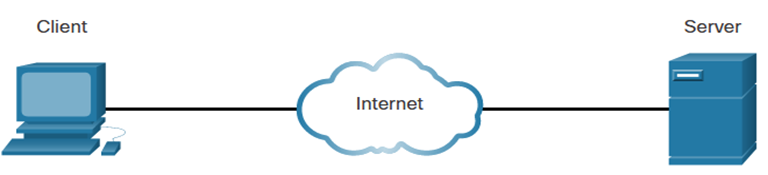

Network Components & Host Roles

Network Components and Host Roles:

1. **Hosts or End Devices:**
   - Every computer connected to a network is referred to as a host or end device.
   - These devices can include personal computers, laptops, tablets, smartphones, printers, and other devices that generate or consume data on the network.

2. **Servers:**
   - Servers are specialized computers designed to provide services or resources to other computers on the network.
   - Different types of servers include:
     - **Email Servers:**
       - Responsible for sending, receiving, and storing emails.
       - Common email server protocols include SMTP (Simple Mail Transfer Protocol) for sending emails and IMAP/POP3 (Internet Message Access Protocol/Post Office Protocol) for retrieving emails.
     - **Web Servers:**
       - Host websites and deliver web pages to client devices upon request.
       - Use protocols such as HTTP (Hypertext Transfer Protocol) to communicate with web clients.
     - **File Servers:**
       - Store and manage files that can be accessed by client devices.
       - Facilitate file sharing and centralized file storage.

3. **Clients:**
   - Clients are computers or devices that request and consume services or resources from servers.
   - Examples include personal computers, laptops, and smartphones.
   - Clients send requests to servers to retrieve information or access services.

**Interactions:**
   - **Web Page Retrieval:**
     - A client, such as a web browser on a personal computer, sends a request for a specific web page to a web server.
     - The web server processes the request and sends the requested web page back to the client, which then displays it for the user.

   - **Email Retrieval:**
     - An email client (e.g., Outlook or Thunderbird) on a user's device sends a request to the email server to retrieve new messages.
     - The email server processes the request and sends the emails to the client for the user to read.

Hosts or end devices encompass all devices connected to a network. Servers provide specific services such as email hosting, web hosting, and file storage. Clients are devices that request and consume these services from servers, creating a dynamic interaction within a networked environment.

