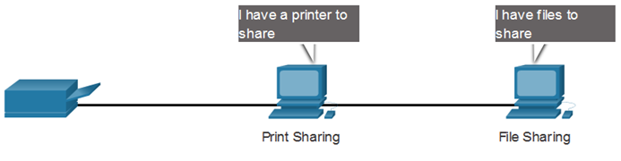

Network Components & Peer-to-Peer

**Network Components and Peer-to-Peer Networks:**

1. **Peer-to-Peer (P2P) Networks:**
   - In a Peer-to-Peer network, each device connected to the network can act as both a client and a server. Unlike client-server models, where specific devices are dedicated to providing services (servers) and others consume those services (clients), P2P networks allow all devices to function as both clients and servers.

2. **Advantages of Peer-to-Peer Networks:**
   - **Simplicity:**
     - P2P networks are easy to set up and manage, making them suitable for small-scale environments without the need for dedicated network infrastructure or servers.

   - **Cost-Effectiveness:**
     - Since there is no need for dedicated servers, the initial setup costs are often lower in P2P networks, making them cost-effective for small businesses or home networks.

   - **Decentralization:**
     - P2P networks distribute the workload across all connected devices, reducing the dependency on a single point of failure. This decentralized nature can enhance reliability.

   - **Ease of Expansion:**
     - Adding new devices to a P2P network is straightforward. Each new device can contribute to the network's resources and services without significant reconfiguration.

3. **Disadvantages of Peer-to-Peer Networks:**
   - **Limited Scalability:**
     - P2P networks are not well-suited for large-scale implementations. As the number of devices increases, the network may become inefficient due to the decentralized nature of resource sharing.

   - **Performance Issues:**
     - As the number of connected devices grows, the performance of individual devices may degrade. This can impact the overall network performance, especially for resource-intensive tasks.

   - **Security Concerns:**
     - P2P networks can be more vulnerable to security threats as each device is both a client and a server. Ensuring proper security measures, such as firewalls and authentication, becomes crucial to prevent unauthorized access or data breaches.

   - **Limited Centralized Control:**
     - The absence of centralized control can make it challenging to implement uniform security policies and manage network resources effectively. Centralized control is often necessary for enforcing access controls and ensuring network stability.

While Peer-to-Peer networks offer simplicity and cost advantages for small environments, they may not be suitable for larger networks where centralized control, scalability, and enhanced security are crucial. The choice between Peer-to-Peer and client-server architectures depends on the specific needs and scale of the network.

