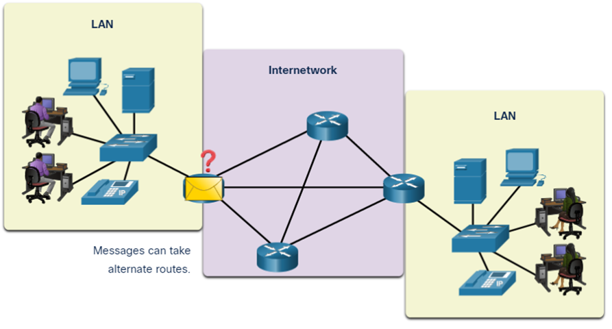

Network Components & End Devices

**Network Components and End Devices in LAN & Internetwork:**

1. **End Devices:**
   - An end device is any device that is a source or destination of a message transmitted over the network.
   - Examples of end devices include computers, laptops, tablets, smartphones, printers, and other devices that generate or consume data.

2. **Data Flow in a Network:**
   - Data originates from an end device, travels through the network, and eventually reaches another end device.
   - The process involves the creation of a message at the source end device, encapsulation of the message into packets, transmission of packets across the network infrastructure, and finally, the delivery and decapsulation of the message at the destination end device.

3. **Local Area Network (LAN):**
   - A Local Area Network (LAN) is a network that is limited to a relatively small geographic area, such as a single building or a campus.
   - LANs typically use high data transfer rates and provide connectivity between devices within a confined space.

4. **End Devices in LANs:**
   - In a LAN, end devices are interconnected to facilitate communication within the local environment.
   - Computers within an office, printers in a shared workspace, and other devices are examples of end devices in a LAN.

5. **Internetwork:**
   - An internetwork, or internet (not to be confused with the Internet), refers to a collection of interconnected networks. It can include LANs, WANs (Wide Area Networks), and other types of networks.

6. **Data Flow in an Internetwork:**
   - In an internetwork, data can traverse multiple networks to reach its destination. Routers are key devices that facilitate this interconnection by forwarding data between different networks.

7. **End Devices in an Internetwork:**
   - End devices in an internetwork include devices connected to different networks that need to communicate with each other.
   - For example, a computer in one LAN may need to communicate with a server in another LAN. The data would flow through routers connecting these LANs.

8. **Importance of End Devices:**
   - End devices play a crucial role in the functioning of a network. They are the source and destination points for data transmission.
   - The effectiveness of a network is determined by how efficiently end devices can communicate and exchange information.

End devices are the points where data originates or is received in a network. In a Local Area Network (LAN), end devices are interconnected within a limited geographic area, while an internetwork involves the interconnection of multiple networks, with end devices facilitating communication across these networks.

