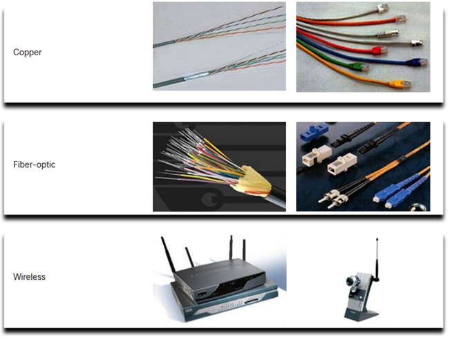

Network Components and Network Media

**Network Components: Network Media - Copper, Fiber Optic, and Wireless:**

1. **Network Media Overview:**
   - Network media, also known as transmission media, is the physical pathway that enables communication between devices on a network.
   - Different types of network media include copper cables, fiber optic cables, and wireless communication.

2. **Copper Cables:**
   - **Types:**
     - Copper cables come in various forms, with the most common being twisted pair cables and coaxial cables.
   - **Twisted Pair Cables:**
     - Composed of pairs of insulated copper wires twisted together.
     - Commonly used for Ethernet connections in local area networks (LANs).
   - **Coaxial Cables:**
     - Consists of a central copper conductor surrounded by insulating material, a metallic shield, and an outer insulating layer.
     - Historically used for cable television connections and early Ethernet networks.

3. **Advantages of Copper Cables:**
   - Cost-effective and widely available.
   - Easy to install and terminate.
   - Suitable for short to medium-distance connections within a building.

4. **Limitations of Copper Cables:**
   - Susceptible to electromagnetic interference (EMI) and radio-frequency interference (RFI).
   - Signal degradation over long distances.
   - Limited bandwidth compared to fiber optics.

5. **Fiber Optic Cables:**
   - **Composition:**
     - Fiber optic cables consist of thin strands of glass or plastic fibers that transmit data using light signals.
   - **Types:**
     - Single-mode fibers for long-distance transmissions.
     - Multi-mode fibers for shorter distances and high-bandwidth applications.
   - **Advantages:**
     - High bandwidth and data transmission rates.
     - Immune to electromagnetic interference.
     - Suitable for long-distance and high-performance applications.
   - **Limitations:**
     - Higher initial cost compared to copper.
     - More delicate and requires specialized tools for installation.

6. **Wireless Communication:**
   - **Types:**
     - Wireless communication utilizes radio waves or microwaves to transmit data without physical cables.
     - Common technologies include Wi-Fi (Wireless Fidelity) for local wireless networks and cellular networks for mobile communication.
   - **Advantages:**
     - Mobility and flexibility, allowing devices to connect without physical constraints.
     - Ideal for situations where wiring is impractical or costly.
   - **Limitations:**
     - Susceptible to interference from other wireless devices and environmental factors.
     - Bandwidth and speed may be lower compared to wired connections.

7. **Choosing the Right Network Media:**
   - The selection of network media depends on factors such as distance, bandwidth requirements, cost, and environmental considerations.
   - Copper cables are often suitable for short-distance connections within buildings.
   - Fiber optic cables are preferred for long-distance, high-bandwidth applications.
   - Wireless communication is chosen for its mobility and flexibility, especially in scenarios where wired connections are challenging.

Network communication relies on different types of media, including copper cables, fiber optic cables, and wireless technologies. Each type of media has its advantages and limitations, and the choice depends on the specific requirements of the network and the application.

