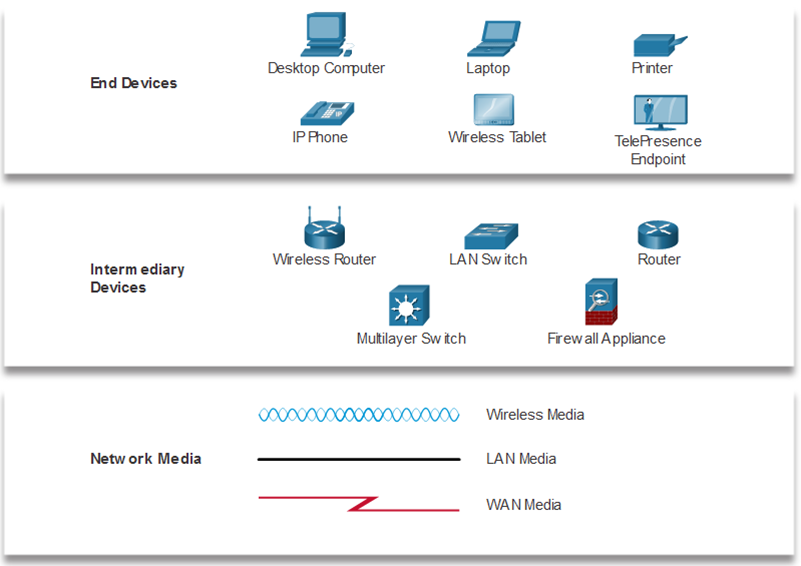

Network Representations and Topologies

**Network Representations and Topologies:**

1. **Network Diagrams:**
   - Network diagrams, also known as topology diagrams, visually represent the structure and connections of devices within a network.
   - Symbols and icons are used to represent different network devices, facilitating a clear understanding of the network layout.

2. **Key Terms:**
   - **Network Interface Card (NIC):**
     - A Network Interface Card, commonly referred to as a NIC, is a hardware component that allows computers to connect to a network.
     - It provides the physical interface between the computer and the network medium (copper cable, fiber optic cable, or wireless signals).
     - The NIC has a unique identifier known as a MAC (Media Access Control) address.

   - **Physical Port:**
     - A physical port is a point of connection on a network device, such as a switch or router, where a network cable is plugged in.
     - Physical ports are used to establish the physical link between devices and enable data transfer.

   - **Interface:**
     - In networking, the term "interface" is often used interchangeably with "port."
     - An interface is a point of interaction between different systems, devices, or networks. It serves as a connection point.
     - For example, a router may have multiple interfaces, each connecting to a different network.

3. **Network Diagram Symbols:**
   - **Computer/Server:**
     - Represented by a rectangle or circle with the device name or IP address.
   - **Switch:**
     - Depicted as a small square or rectangle with multiple lines extending from it, indicating connected devices.
   - **Router:**
     - Shown as a rectangle or hexagon with lines connecting to different networks.
   - **Wireless Access Point:**
     - Symbolized by a small circle or triangle with radio waves emanating from it.
   - **Cloud:**
     - Used to represent external networks or the internet.
   - **Firewall:**
     - Depicted as a rectangle with additional symbols representing security features.

4. **Topology Representations:**
   - **Physical Topology:**
     - Represents the physical layout of devices and connections in the network.
     - Shows the arrangement of devices, cables, and physical locations of network components.

   - **Logical Topology:**
     - Represents how data flows within the network.
     - Focuses on the logical relationships and communication pathways between devices.

   - **Common Topologies:**
     - **Bus Topology:** Devices are connected to a single central cable.
     - **Star Topology:** Devices are connected to a central hub or switch.
     - **Ring Topology:** Devices are connected in a circular fashion.
     - **Mesh Topology:** Devices are interconnected with multiple paths.

5. **Importance of Network Diagrams:**
   - **Documentation:**
     - Network diagrams serve as documentation for understanding and troubleshooting network configurations.
   - **Planning:**
     - They assist in planning and designing network layouts.
   - **Communication:**
     - Network diagrams facilitate communication among IT professionals, helping them visualize and discuss network structures.

Network diagrams use symbols to represent devices and connections in a network. Understanding key terms such as Network Interface Card (NIC), Physical Port, and Interface is crucial for comprehending the physical and logical aspects of network representations and topologies.

