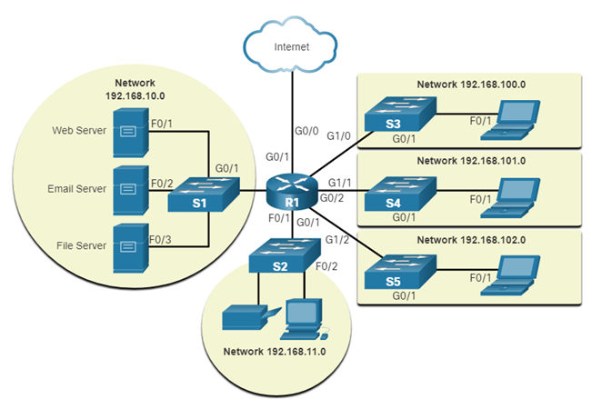

Network Representations and Topology Diagrams

**Network Representations and Topology Diagrams:**

1. **Physical Topology Diagrams:**
   - **Definition:**
     - Physical topology diagrams provide a visual representation of the physical layout of network devices and the connections between them.
     - They showcase the actual placement of intermediary devices such as routers, switches, and servers, as well as the routing of cables.
   - **Elements Included:**
     - **Intermediary Devices:**
       - Routers, switches, hubs, and other physical devices are depicted in their actual physical locations within a building or across multiple locations.
     - **Cable Installation:**
       - The physical routes of network cables, such as Ethernet cables, fiber optic cables, or coaxial cables, are illustrated.
       - This includes the paths cables take through walls, ceilings, and floors to connect devices.

2. **Logical Topology Diagrams:**
   - **Definition:**
     - Logical topology diagrams illustrate how data flows through the network and the logical relationships between devices.
     - They focus on the communication pathways, addressing schemes, and logical connections within the network.
   - **Elements Included:**
     - **Devices and Ports:**
       - Devices such as computers, servers, routers, and switches are represented along with the logical connections between them.
       - Logical connections may include virtual LANs (VLANs) or logical grouping of devices.
     - **Addressing Scheme:**
       - IP addresses and logical addressing schemes are visualized to depict how devices communicate in a logical sense.
       - Subnets, IP ranges, and addressing assignments are often part of the logical topology.
   - **Communication Flow:**
       - Arrows or lines show the direction of data flow between devices, representing the logical paths data takes through the network.
       - Logical topology diagrams help in understanding the flow of information and how devices communicate with each other logically.

3. **Importance of Physical and Logical Topology Diagrams:**
   - **Troubleshooting:**
     - Physical diagrams aid in troubleshooting physical connectivity issues, such as cable faults or device placement problems.
     - Logical diagrams help in identifying and resolving logical communication issues and configuration errors.
   - **Design and Planning:**
     - Physical diagrams assist in designing the layout of network components and planning for expansion or changes.
     - Logical diagrams are essential for planning the logical structure of the network, ensuring efficient data flow and addressing.
   - **Documentation:**
     - Both physical and logical diagrams serve as documentation for IT professionals, providing a visual reference for network configurations.

4. **Combining Physical and Logical Topology Information:**
   - **Comprehensive Understanding:**
     - Network administrators often use both physical and logical topology diagrams to gain a comprehensive understanding of the network.
     - Combining these representations helps in addressing issues related to both physical connectivity and logical communication.

Physical topology diagrams illustrate the physical layout and cable installations within a network, while logical topology diagrams depict the logical connections, addressing schemes, and communication flow between devices. Both types of diagrams are crucial for designing, managing, and troubleshooting complex networks.

