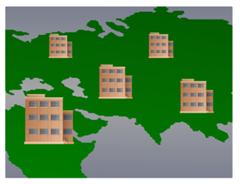

Common Types of Networks and Networks of Many Sizes

**Common Types of Networks:**

1. **Small Home Networks:**
   - **Description:**
     - Small home networks are designed to connect a few computers to each other and provide access to the Internet.
     - Typical devices include personal computers, laptops, smartphones, tablets, and network-enabled smart devices.
   - **Purpose:**
     - Facilitates file sharing, printer sharing, and internet access within a household.
     - Often implemented using a wireless router to provide Wi-Fi connectivity.

2. **Small Office/Home Office (SOHO) Networks:**
   - **Description:**
     - SOHO networks cater to the needs of small offices or home offices.
     - Devices may include computers, printers, and networked peripherals.
   - **Purpose:**
     - Enables seamless connectivity for work-related tasks.
     - Allows remote offices to connect to a corporate network for centralized resources.

3. **Medium to Large Networks:**
   - **Description:**
     - Medium to large networks are characterized by having many locations with hundreds or thousands of interconnected computers.
     - They often span across multiple buildings, campuses, or geographical locations.
   - **Purpose:**
     - Supports a larger user base and more complex infrastructure.
     - Provides centralized resources, such as file servers, email servers, and databases.
     - Commonly found in businesses, universities, and large organizations.

4. **World Wide Networks:**
   - **Description:**
     - World Wide Networks refer to global networks that connect hundreds of millions of computers worldwide, exemplified by the Internet.
     - They encompass a vast and interconnected infrastructure of networks and data centers.
   - **Purpose:**
     - Facilitates global communication, information sharing, and access to online services.
     - Supports a wide range of applications, including email, web browsing, video streaming, and online collaboration.
   - **Infrastructure:**
     - Comprised of various network components, including routers, switches, servers, and undersea fiber optic cables.

5. **Internet Service Providers (ISPs):**
   - **Description:**
     - ISPs play a crucial role in providing connectivity to small home networks, SOHO networks, medium to large networks, and the Internet as a whole.
     - They serve as the gateway for users to access the global network.
   - **Purpose:**
     - Offers internet connectivity to end-users and businesses.
     - Manages the infrastructure required for data transmission across the Internet.

6. **Wireless Networks:**
   - **Description:**
     - Wireless networks utilize radio waves to connect devices without the need for physical cables.
     - Commonly used in small home networks, SOHO environments, and for mobile devices.
   - **Purpose:**
     - Enables flexible and mobile connectivity within a defined range.
     - Facilitates Wi-Fi access for devices like smartphones, laptops, and tablets.

7. **Virtual Private Networks (VPNs):**
   - **Description:**
     - VPNs create secure, encrypted connections over the internet, allowing users to access a private network remotely.
     - Widely used for secure communication in remote work scenarios.
   - **Purpose:**
     - Provides a secure and private connection for remote access to corporate networks.
     - Encrypts data to ensure confidentiality during transmission.

Networks come in various sizes and serve different purposes, ranging from small home networks to global World Wide Networks. The type and scale of a network depend on the specific needs and requirements of users or organizations.

