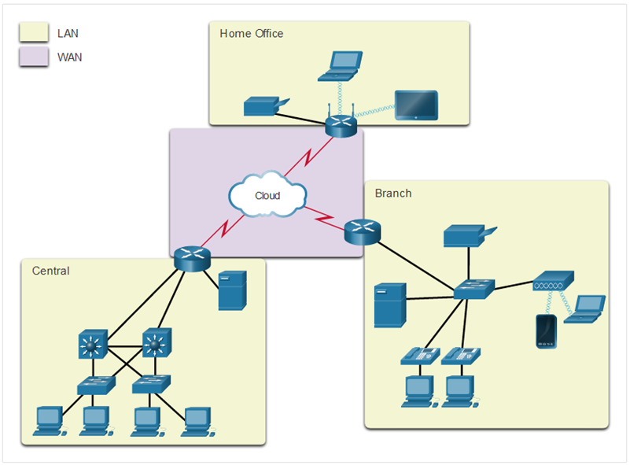

Common Types of Networks and LANs and WANs

**Common Types of Networks, LANs, and WANs:**

**Network Infrastructure Variations:**
Network infrastructures exhibit significant variability based on several factors:

1. **Size of the Area Covered:**
   - **Local Area Network (LAN):**
     - Typically covers a small geographic area, such as a single building, campus, or office.
     - Limited to a short-range, allowing high data transfer rates within the local area.

   - **Wide Area Network (WAN):**
     - Spans a larger geographic area, connecting networks across cities, countries, or continents.
     - Involves long-distance communication, often utilizing public and private communication lines.

2. **Number of Users Connected:**
   - **LAN:**
     - Supports a limited number of users within the local area.
     - Ideal for connecting devices within a single organization or a specific physical location.

   - **WAN:**
     - Accommodates a larger number of users distributed across different locations.
     - Suitable for connecting multiple branches of an organization or facilitating communication on a global scale.

3. **Number and Types of Services Available:**
   - **LAN:**
     - Provides services such as file sharing, printer sharing, and centralized data storage within the local area.
     - Supports a range of services required for internal communication and collaboration.

   - **WAN:**
     - Offers services that enable long-distance communication, including email, video conferencing, and access to centralized databases.
     - Supports a broader range of applications and services to meet the needs of a dispersed user base.

4. **Area of Responsibility:**
   - **LAN:**
     - Generally the responsibility of a single organization or entity that owns or manages the local area network.
     - Provides control over the network infrastructure and services within the defined area.

   - **WAN:**
     - Involves communication between networks that may be owned and managed by different organizations or service providers.
     - Responsibility is distributed among various entities involved in the WAN infrastructure.

**Two Most Common Types of Networks:**

1. **Local Area Network (LAN):**
   - **Characteristics:**
     - Limited geographic scope, such as a building or campus.
     - High data transfer rates within the local area.
     - Supports a relatively small number of users.
   - **Use Cases:**
     - Commonly used within offices, schools, and small businesses.
     - Facilitates internal communication and resource sharing.

2. **Wide Area Network (WAN):**
   - **Characteristics:**
     - Encompasses a larger geographic area, potentially spanning cities, countries, or continents.
     - Lower data transfer rates compared to LANs.
     - Accommodates a larger number of users dispersed across different locations.
   - **Use Cases:**
     - Utilized by large enterprises with multiple branches.
     - Enables global communication, connecting users and resources across distant locations.

LANs and WANs represent the two most common types of networks, each tailored to specific geographic, user, and service requirements. LANs are localized, high-speed networks, while WANs provide connectivity over longer distances, supporting a larger and more dispersed user base.

**Common Types of Networks:**

1. **Local Area Networks (LANs):**
   - **Description:**
     - LANs are networks that are limited to a small geographic area, such as a single building, campus, or office.
     - Devices within a LAN are connected to a common network and can communicate directly with each other.
   - **Key Characteristics:**
     - High data transfer rates within the local area.
     - Often used for connecting computers, printers, and other devices within a specific location.
     - Can be wired (Ethernet) or wireless (Wi-Fi).

2. **Wide Area Networks (WANs):**
   - **Description:**
     - WANs cover a larger geographic area compared to LANs, connecting networks across cities, countries, or even continents.
     - WANs use public and private communication lines, including leased lines or the internet.
   - **Key Characteristics:**
     - Lower data transfer rates compared to LANs.
     - Facilitates long-distance communication between geographically dispersed locations.
     - Commonly used by large organizations with offices in multiple locations.

3. **Metropolitan Area Networks (MANs):**
   - **Description:**
     - MANs fall between LANs and WANs in terms of geographic coverage, typically covering a city or a large campus.
     - They provide connectivity for organizations with multiple buildings in a metropolitan area.
   - **Key Characteristics:**
     - Greater coverage than a LAN but smaller than a WAN.
     - Utilizes high-capacity network infrastructure to connect different sites within a city.

4. **Personal Area Networks (PANs):**
   - **Description:**
     - PANs are small, personal networks designed for individual users.
     - Typically involve the connection of personal devices like smartphones, tablets, and laptops.
   - **Key Characteristics:**
     - Very short-range connectivity, often within a few meters.
     - Utilizes technologies like Bluetooth or near-field communication (NFC).

5. **Campus Area Networks (CANs):**
   - **Description:**
     - CANs connect multiple buildings within a university campus or corporate campus.
     - Designed to provide high-speed communication between different departments or entities within the same physical area.
   - **Key Characteristics:**
     - Larger coverage than a LAN but limited to a specific campus.
     - Often employs fiber optic cables for high-speed connections.

6. **Home Area Networks (HANs):**
   - **Description:**
     - HANs are networks within a home, connecting various devices and appliances.
     - Devices may include computers, smart TVs, smart home devices, and more.
   - **Key Characteristics:**
     - Supports communication and data sharing among devices within a household.
     - Utilizes Wi-Fi and wired connections.

7. **Enterprise Networks:**
   - **Description:**
     - Enterprise networks are comprehensive networks designed to meet the needs of large organizations.
     - They can include a combination of LANs, WANs, MANs, and other network types to support the organization's operations.
   - **Key Characteristics:**
     - Scalable and capable of handling a large number of users and devices.
     - Integrates various network technologies for efficient communication.

Networks come in various types to cater to different scales and purposes. LANs are localized networks within a specific area, while WANs cover larger geographic regions. Additional network types, such as MANs, PANs, CANs, HANs, and enterprise networks, address specific needs and use cases within their defined scopes.

