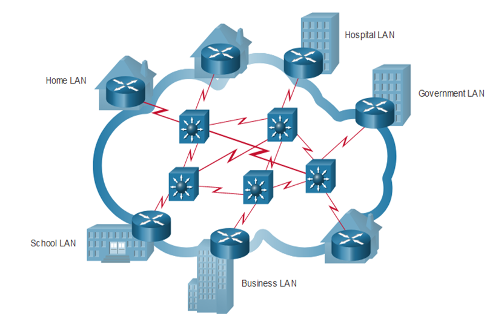

Common Types of Networks and The Internet

**Common Types of Networks and The Internet:**

**The Internet:**
- **Definition:**
  - The internet is a global network that connects millions of private, public, academic, business, and government networks. It is a vast, decentralized network of networks that spans the globe.

- **Composition:**
  - The internet is a worldwide collection of interconnected Local Area Networks (LANs) and Wide Area Networks (WANs).
  - LANs represent smaller, localized networks, while WANs facilitate long-distance connections between LANs.

- **Connectivity:**
  - LANs are interconnected to each other using WANs, forming a complex web of connections that allows seamless global communication.

- **Transmission Medium in WANs:**
  - WANs, responsible for long-distance connectivity, employ various transmission mediums, including:
    - **Copper Wires:** Traditional telephone lines and DSL (Digital Subscriber Line) connections.
    - **Fiber Optic Cables:** High-speed and high-capacity transmission using light signals.
    - **Wireless Transmissions:** Satellite connections, radio waves, and other wireless technologies.

**Ownership and Governance of the Internet:**
- **Ownership:**
  - The internet is not owned by any single individual, organization, or government. Instead, it is a collaborative effort involving contributions from various entities worldwide.

- **Internet Governance Bodies:**
  - To maintain structure, standards, and protocols on the internet, several organizations were developed:
    - **IETF (Internet Engineering Task Force):**
      - A global community of experts that develops and promotes voluntary internet standards.
      - Focuses on the technical development and evolution of the internet.
    - **ICANN (Internet Corporation for Assigned Names and Numbers):**
      - Responsible for coordinating and maintaining the global Domain Name System (DNS) and IP address allocation.
      - Ensures the uniqueness and stability of domain names on the internet.
    - **IAB (Internet Architecture Board):**
      - Works in conjunction with the IETF to provide architectural oversight for the internet.
      - Addresses issues related to the evolution and development of the internet's architecture.

- **Functions:**
  - These organizations collaborate to establish standards, allocate resources, and address technical challenges to ensure the smooth operation and growth of the internet.

**Key Features of the Internet:**
- **Decentralization:**
  - The internet's design promotes decentralization, allowing it to remain resilient in the face of disruptions and adaptable to evolving technologies.

- **Global Accessibility:**
  - The internet enables global communication, providing access to information, services, and resources from virtually anywhere in the world.

- **Open Standards:**
  - The use of open standards and protocols, as developed by organizations like the IETF, ensures interoperability and compatibility among diverse devices and networks.

- **Evolution and Expansion:**
  - The internet is continually evolving, adapting to technological advancements and expanding its capabilities to meet the changing needs of users and applications.

The internet serves as a global network connecting LANs and WANs worldwide. It operates based on open standards, and its governance involves collaborative efforts from organizations like IETF, ICANN, and IAB to maintain structure, standards, and protocols.

