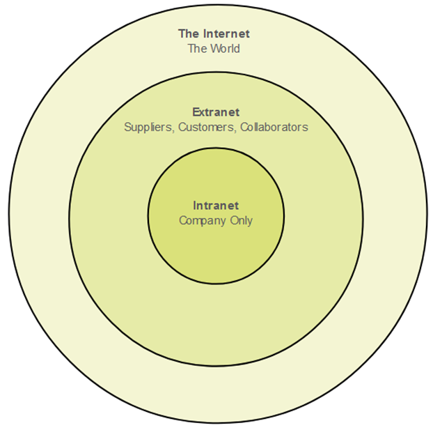

Common Types of Networks - Intranets and Extranets

Networks play a crucial role in connecting and facilitating communication between devices and systems. In the context of organizations, intranets and extranets are two common types of networks that serve specific purposes.

1. **Intranet:**
   - **Definition:** An intranet is a private network that is confined within an organization. It is built using Local Area Networks (LANs) and Wide Area Networks (WANs) to connect internal systems and devices.
   - **Accessibility:** Intranets are meant to be accessible only to the members or employees of the organization. Users typically need authorization, such as a username and password, to access the intranet.
   - **Purpose:** Intranets are used for internal communication, collaboration, and information sharing within an organization. They often host internal websites, file sharing systems, email services, and other applications that facilitate efficient communication among employees.

2. **Extranet:**
   - **Definition:** An extranet is a network that expands beyond the internal boundaries of an organization to include external users with specific permissions. It is essentially an extension of an intranet, providing controlled access to authorized external parties.
   - **Accessibility:** Extranets allow specific individuals or organizations to access a portion of an organization's network. These external users may include clients, partners, suppliers, or other stakeholders. Access is usually restricted and controlled to protect sensitive information.
   - **Purpose:** Extranets facilitate secure collaboration and information sharing between an organization and its external partners. For example, a company might use an extranet to provide clients with access to project updates, documents, or collaboration tools. Security measures are implemented to ensure that only authorized individuals can access the extranet.

Both intranets and extranets contribute to improving communication, collaboration, and efficiency within and beyond an organization's boundaries. They are essential components of modern business networks, helping to streamline processes and enhance information sharing while maintaining security and access controls.
