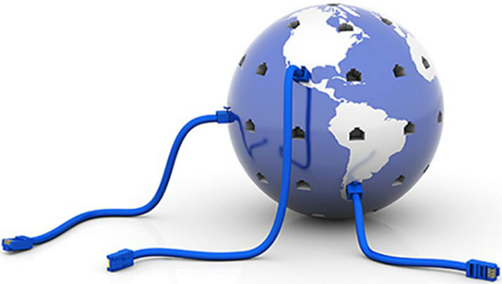

Internet Connections - Internet Access Technologies

Internet connections are vital for connecting users and organizations to the vast world of the internet. Various technologies and services cater to different needs, ranging from home users and small offices to larger organizations.

1. **Broadband Cable:**
   - **Description:** Broadband cable internet utilizes the same coaxial cables that deliver cable television signals. It provides high-speed internet access and is widely available in urban and suburban areas.
   - **Speeds:** Speeds can vary but are generally high, making it suitable for activities like streaming, online gaming, and general internet usage.

2. **Digital Subscriber Line (DSL):**
   - **Description:** DSL uses traditional telephone lines to provide internet access. It allows simultaneous use of the telephone line for voice communication while accessing the internet.
   - **Speeds:** Speeds are generally lower than cable but can still provide reliable internet access for small businesses and residential users.

3. **Wireless WANs:**
   - **Description:** Wireless Wide Area Networks (WANs) use radio signals to provide internet access. Technologies like WiMAX and point-to-point wireless connections fall into this category.
   - **Advantages:** Wireless WANs are suitable for areas where laying physical cables is challenging or expensive. They can provide internet access in rural or remote locations.

4. **Mobile Services:**
   - **Description:** Mobile services, often provided by cellular networks, offer internet access through smartphones, tablets, and mobile hotspots.
   - **Flexibility:** Mobile services provide on-the-go internet access, making them suitable for users who need connectivity outside of fixed locations.

For organizations with higher demands and specific requirements, business-class internet connections are available. These include:

1. **Business DSL:**
   - **Description:** Similar to residential DSL but with higher speeds and dedicated support for businesses. It offers reliable internet access for small and medium-sized enterprises (SMEs).

2. **Leased Lines:**
   - **Description:** Leased lines provide dedicated, high-capacity internet connections directly to the organization. They offer symmetrical upload and download speeds and are suitable for large enterprises requiring consistent and high-performance connectivity.

3. **Metro Ethernet:**
   - **Description:** Metro Ethernet services provide high-speed, scalable, and flexible connectivity within a metropolitan area. They are often used for connecting multiple locations within a city.

These internet access technologies cater to a wide range of users and organizations, ensuring that there's a suitable option for different needs, from casual home use to the demanding requirements of large enterprises. The choice of technology depends on factors such as location, budget, speed requirements, and the specific needs of the users or organization.

