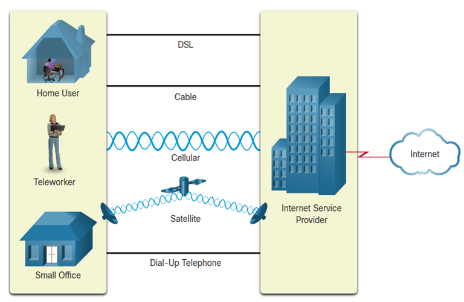

Internet Connections - Home and Small Office Internet Connections

Home and small office internet connections come in various forms, each with its own set of advantages and considerations.

1. **Cable Internet:**
   - **Technology:** Cable internet uses the same coaxial cables that deliver cable television signals. It operates on the same principle, sending data over different frequencies than those used for television.
   - **Speeds:** Cable internet can offer high-speed connections, with download speeds typically ranging from 20 Mbps to over 1 Gbps. However, actual speeds can vary based on factors such as network congestion and the user's distance from the service provider's infrastructure.
   - **Advantages:** Cable internet is widely available, especially in urban and suburban areas. It's known for delivering fast and reliable internet access.

2. **DSL (Digital Subscriber Line):**
   - **Technology:** DSL uses existing telephone lines to provide internet access. It operates on frequencies that are separate from those used for voice communication, allowing users to use the internet and make phone calls simultaneously.
   - **Speeds:** DSL speeds can vary widely based on factors like distance from the telephone exchange and the quality of the copper lines. Download speeds typically range from 1 Mbps to 100 Mbps.
   - **Advantages:** DSL is available in many areas and is a cost-effective option for users who don't require extremely high speeds.

3. **Satellite Internet:**
   - **Technology:** Satellite internet relies on satellites in orbit to transmit and receive data signals. Users have a satellite dish installed at their location to establish a connection.
   - **Speeds:** Satellite internet speeds have improved in recent years but are generally lower than cable or DSL. Download speeds typically range from 12 Mbps to 100 Mbps, but latency (signal travel time) can be higher, impacting real-time activities like online gaming or video conferencing.
   - **Advantages:** Satellite internet is available in remote or rural areas where other types of internet may not be accessible. It provides a viable option for users who don't have access to traditional broadband services.

It's important to note that the actual speeds experienced by users can depend on various factors, including the internet service provider, network congestion, the chosen service plan, and the quality of the infrastructure in a particular area. Additionally, advancements in technology and infrastructure improvements can lead to changes in the capabilities and availability of these internet connection types over time. When choosing an internet connection for a home or small office, it's recommended to consider the specific needs, location, and available options to make an informed decision.

