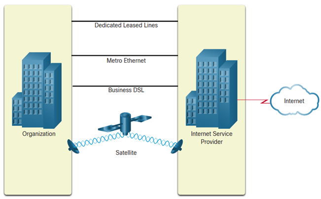

Internet Connections - Businesses Internet Connections

Business internet connections for corporate environments often have more stringent requirements compared to home or small office connections. Corporate business connections typically prioritize reliability, scalability, security, and higher performance.

1. **Higher Bandwidth:**
   - **Requirement:** Corporate environments often require higher bandwidth to support the increased data traffic generated by various business applications, cloud services, and multimedia content.
   - **Benefits:** Higher bandwidth ensures that the organization can handle simultaneous data transfers, video conferencing, large file uploads and downloads, and other data-intensive tasks without performance degradation.

2. **Dedicated Connections:**
   - **Requirement:** Businesses may opt for dedicated connections, which provide a consistent and dedicated link to the internet, as opposed to shared connections used in residential or small office settings.
   - **Benefits:** Dedicated connections ensure that the organization has exclusive access to the allocated bandwidth, reducing the impact of network congestion and enhancing overall reliability and performance.

3. **Managed Services:**
   - **Requirement:** Managed services involve outsourcing certain aspects of network management to a service provider. This can include services such as security, monitoring, and maintenance.
   - **Benefits:** Managed services allow businesses to focus on their core activities while relying on experts to manage and optimize their network infrastructure. It can enhance security, provide proactive monitoring, and ensure the network is running efficiently.

4. **Dedicated Lease Line:**
   - **Description:** A dedicated lease line is a dedicated, point-to-point connection between two locations. It is often used for connecting different offices of the same organization.
   - **Benefits:** Dedicated lease lines provide high reliability and security, ensuring a private and direct connection between locations. They are suitable for organizations with offices in different geographical locations.

5. **Ethernet WAN Speed:**
   - **Description:** Ethernet Wide Area Network (WAN) services provide high-speed, scalable connectivity between different locations.
   - **Benefits:** Ethernet WAN services offer high bandwidth, flexibility, and the ability to easily scale to meet growing business needs. They are suitable for organizations with multiple offices that need to share data and resources seamlessly.

6. **DSL Speed:**
   - **Description:** While Digital Subscriber Line (DSL) is more commonly associated with residential use, business-grade DSL services with higher speeds are available for small to medium-sized enterprises (SMEs).
   - **Benefits:** DSL for businesses provides a cost-effective solution for smaller organizations that do not require the high bandwidths needed by larger enterprises. It can be a suitable option for businesses with moderate internet usage.

7. **MPLS (Multiprotocol Label Switching) and VPLS (Virtual Private LAN Service):**
   - **Description:** MPLS and VPLS are technologies used to create private and secure networks for businesses, connecting multiple locations.
   - **Benefits:** MPLS and VPLS offer enhanced security, low latency, and the ability to prioritize traffic, making them suitable for organizations with critical applications such as voice and video conferencing.

It's important for businesses to carefully assess their specific needs and choose an internet connection that aligns with their requirements for performance, reliability, and security. The choice may involve a combination of different technologies to create a robust and efficient network infrastructure tailored to the organization's objectives.

