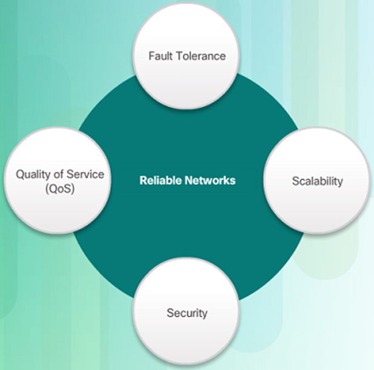

Reliable Network - Network Architecture

Reliable network architecture is crucial for ensuring that data can be transmitted efficiently, securely, and with minimal disruptions across a network. Network architecture refers to the design and arrangement of components that make up a network, and it plays a key role in determining the network's performance and reliability. Here are four fundamental characteristics that underlying architectures should address to meet user expectations:

1. **Fault Tolerance:**
   - **Definition:** Fault tolerance is the ability of a network to continue operating smoothly even when components fail or experience disruptions. It involves designing the network in such a way that the failure of a single component does not lead to a complete network outage.
   - **Implementation:** Redundancy is a common strategy for achieving fault tolerance. This involves having backup components or paths that can take over in case of a failure. For example, having redundant servers, routers, or connections can help maintain network operation even if one of them fails.

2. **Scalability:**
   - **Definition:** Scalability refers to the network's ability to handle growth and increased demand for resources. A scalable network can efficiently accommodate additional users, devices, or data traffic without a significant decrease in performance.
   - **Implementation:** Designing a scalable network involves considerations such as the capacity of network devices, the flexibility to add new components, and the ability to adapt to changing requirements. Scalability is crucial for networks that need to support a growing number of users or expanding data volumes.

3. **Quality of Service (QoS):**
   - **Definition:** Quality of Service is a measure of the network's ability to prioritize different types of data traffic to ensure that critical applications receive the necessary resources and perform well. QoS helps in maintaining a consistent level of service quality for different applications and users.
   - **Implementation:** QoS mechanisms involve traffic prioritization, bandwidth allocation, and network resource management. For example, voice and video data may be prioritized over non-time-sensitive data to ensure a smoother user experience.

4. **Security:**
   - **Definition:** Security is a critical aspect of network architecture, ensuring that data remains confidential, integrity is maintained, and unauthorized access is prevented. Security measures protect the network from cyber threats and unauthorized activities.
   - **Implementation:** Security features include encryption, firewalls, access controls, and intrusion detection systems. Network architects must implement a multi-layered security strategy to safeguard data as it travels across the network and to protect against various types of cyber threats.

A well-designed network architecture takes into account these four characteristics to create a reliable, efficient, and secure infrastructure. Achieving a balance among fault tolerance, scalability, quality of service, and security is essential to meet the diverse needs of users and organizations in an ever-evolving technological landscape.

Reliable Network - Fault Tolerance

Fault tolerance in network design is a critical aspect that ensures the continued operation of a network even in the presence of failures. The goal is to limit the impact of failures by minimizing the number of affected devices and providing mechanisms for redundancy. 

1. **Limiting the Impact of Failure:**
   - **Definition:** Fault tolerance is about designing a network in such a way that the failure of a single component, such as a router, switch, or connection, does not lead to a complete network outage.
   - **Implementation:** To limit the impact of failure, redundant components and paths are introduced. This means that if one component fails, another can take over seamlessly. Redundancy can be applied at various levels, including hardware (devices and links), software (protocols and services), and data.

2. **Multiple Paths for Fault Tolerance:**
   - **Requirement:** For fault tolerance, networks need to have multiple paths for data to travel from source to destination. If one path becomes unavailable due to a failure, an alternative path can be used to maintain connectivity.
   - **Implementation:** Redundant paths can be achieved through technologies such as link aggregation, where multiple physical links are bundled together, or through dynamic routing protocols that can adapt to changes in the network topology.

3. **Packet Switching for Redundancy:**
   - **Definition:** Packet switching is a method of network communication where data is divided into small packets, and each packet is transmitted independently to its destination. This is in contrast to circuit-switched networks, where a dedicated circuit is established for the duration of a communication session.
   - **Benefits:** Packet switching allows for greater fault tolerance because each packet can take a different path to reach the destination. If one path is unavailable or congested, packets can be rerouted dynamically through available paths.

4. **Redundancy in Packet-Switched Networks:**
   - **Implementation:** Redundancy in packet-switched networks is achieved through the use of routing protocols that dynamically adapt to changes in the network. If a link or device fails, the routing protocol can reroute traffic through alternative paths. Additionally, technologies like Virtual LANs (VLANs) and Virtual Router Redundancy Protocol (VRRP) provide redundancy at the device level.

5. **Contrast with Circuit-Switched Networks:**
   - **Explanation:** Circuit-switched networks, in contrast, establish dedicated circuits for the duration of a communication session. This can limit fault tolerance because if a circuit fails, the communication session is disrupted, and alternative paths are not readily available.
   - **Advantages of Packet Switching:** Packet switching provides a more flexible and fault-tolerant approach, allowing for efficient use of network resources and the ability to adapt to changing conditions.

Fault tolerance in network design involves creating redundant paths and components to limit the impact of failures. Packet switching, with its ability to route packets dynamically and take multiple paths, is a key technology that enhances fault tolerance in modern networks.

Reliable Network - Scalability

Scalability in the context of network design refers to the ability of a network to grow and expand efficiently to support an increasing number of users, devices, and applications without compromising performance or reliability. A scalable network should be able to accommodate growth without requiring a complete overhaul of its infrastructure. 

1. **Ability to Expand Quickly and Easily:**
   - **Definition:** A scalable network allows for quick and easy expansion to meet the increasing demands placed on it, whether it be an increase in the number of users, devices, or the addition of new applications and services.
   - **Implementation:** Scalability is achieved by designing the network with flexibility in mind. This includes using modular hardware and software components, implementing efficient routing protocols, and employing technologies that can seamlessly integrate new elements.

2. **Support for New Users and Applications:**
   - **Requirement:** A scalable network should be able to support the addition of new users and applications without a significant degradation in performance for existing users.
   - **Implementation:** Technologies such as Virtual LANs (VLANs), subnetting, and Quality of Service (QoS) mechanisms can help in isolating and prioritizing traffic, ensuring that new applications or users do not negatively impact the performance of existing services.

3. **Standards and Protocols:**
   - **Guidance:** Network designers adhere to accepted standards and protocols to ensure interoperability and compatibility between different network components. This is crucial for scalability because it allows for the integration of diverse devices and technologies.
   - **Examples:** Common networking standards include TCP/IP (Transmission Control Protocol/Internet Protocol) for communication between devices on the internet, and Ethernet for connecting devices within a local network.

4. **Modular Design:**
   - **Approach:** A modular design approach involves breaking down the network into smaller, manageable components or modules. This allows for easier expansion and modification of specific parts of the network without affecting the entire infrastructure.
   - **Benefits:** Modularity enhances scalability by facilitating the addition of new devices or services to specific modules without disrupting the overall network functionality.

5. **Scalability Planning:**
   - **Strategy:** Scalability should be a consideration from the initial design phase. Network designers need to anticipate future growth and plan the network architecture accordingly.
   - **Implementation:** This may involve deploying technologies such as load balancing, which distributes network traffic evenly across multiple servers, or implementing dynamic routing protocols that can adapt to changes in network topology.

6. **Cloud Computing and Virtualization:**
   - **Impact:** Cloud computing and virtualization technologies contribute significantly to network scalability. By moving services to the cloud or virtualizing resources, organizations can easily scale their infrastructure up or down based on demand.
   - **Benefits:** Cloud services, such as Infrastructure as a Service (IaaS) and Platform as a Service (PaaS), provide flexible and scalable solutions for hosting applications and services.

Scalability is a critical consideration in network design to ensure that the network can grow and adapt to changing requirements efficiently. By adhering to standards, implementing modular designs, and considering future growth from the outset, network designers can create scalable architectures that meet the evolving needs of users and applications.

Reliable Network - Quality of Service

Quality of Service (QoS) is a set of techniques and technologies used to manage and prioritize network traffic to ensure a consistent and high-quality user experience. QoS is particularly crucial in scenarios where certain applications or services, such as voice and live video transmissions, require specific levels of performance to maintain their effectiveness. 

1. **Definition of Quality of Service (QoS):**
   - **Objective:** QoS aims to provide predictable and controlled network performance by prioritizing certain types of traffic over others.
   - **Implementation:** QoS mechanisms are implemented at various points in the network, including routers, switches, and other networking devices. These mechanisms help ensure that critical applications receive the necessary resources and that the network can adapt to varying levels of demand.

2. **Importance of QoS for Voice and Live Video:**
   - **Requirement:** Voice and live video transmissions are sensitive to delays, jitter, and packet loss. To ensure a seamless experience for users, it's essential to prioritize and manage the flow of data for these real-time applications.
   - **Challenges Without QoS:** Without QoS, high-demand situations can lead to network congestion, resulting in packet loss, delays, and interruptions in voice and video transmissions. This can cause a degraded user experience, including pauses and breaks in live video streams.

3. **Bandwidth Management with QoS:**
   - **Capacity Planning:** QoS helps in managing bandwidth efficiently, ensuring that critical applications receive the required amount of bandwidth to maintain performance.
   - **Traffic Prioritization:** QoS enables the prioritization of different types of traffic. For example, voice and video traffic can be given higher priority over less time-sensitive data, such as file downloads.

4. **QoS Policies:**
   - **Configuration:** QoS is implemented through the creation and enforcement of QoS policies. These policies define how traffic should be treated based on factors like application type, source, destination, and the required level of service.
   - **Traffic Classification and Marking:** Traffic is often classified and marked based on its characteristics, allowing routers and switches to apply QoS policies accordingly.

5. **Managing Flow of Data:**
   - **Traffic Shaping:** QoS mechanisms, such as traffic shaping, help control the flow of data by regulating the rate at which data is sent. This can prevent network congestion and ensure that resources are allocated appropriately.
   - **Buffer Management:** QoS helps manage buffer space in networking devices, preventing overflow and ensuring that critical data, especially real-time applications, is processed without significant delays.

6. **QoS Protocols:**
   - **Examples:** Different protocols and technologies are used to implement QoS, including Differentiated Services (DiffServ) and Resource Reservation Protocol (RSVP).
   - **Benefits:** These protocols enable routers and switches to prioritize traffic based on defined QoS policies, ensuring that critical applications receive the necessary priority and resources.

QoS is a critical component of reliable network design, particularly for applications that demand consistent performance, such as voice and live video transmissions. By implementing QoS policies and mechanisms, network administrators can effectively manage the flow of data, prioritize critical traffic, and ensure a high-quality user experience across the network.

Reliable Network - Network Security

Network security is a critical aspect of maintaining a reliable and trustworthy network infrastructure. It involves the implementation of measures to protect the network's integrity, confidentiality, and availability. There are two main types of network security that must be addressed: Network Infrastructure Security and Information Security.

1. **Network Infrastructure Security:**
   - **Definition:** Network infrastructure security focuses on safeguarding the physical and logical components of the network, including routers, switches, firewalls, servers, and other network devices.
   - **Key Aspects:**
      - **Preventing Unauthorized Access:** This involves implementing authentication mechanisms, such as usernames and passwords, to ensure that only authorized individuals can access network devices.
      - **Physical Security:** Protecting the physical security of network devices involves measures such as securing data centers, server rooms, and network closets to prevent unauthorized physical access.
      - **Firewall Protection:** Firewalls are crucial components of network infrastructure security, acting as barriers between internal and external networks to filter and monitor incoming and outgoing traffic.

2. **Information Security:**
   - **Definition:** Information security focuses on protecting the data and information transmitted over the network from unauthorized access, alteration, or disclosure.
   - **Key Aspects:**
      - **Confidentiality:** Ensures that only authorized individuals have access to sensitive data. Encryption, secure communication protocols, and access controls help maintain confidentiality.
      - **Integrity:** Guarantees that data remains unaltered during transmission. Techniques such as checksums, digital signatures, and hash functions are employed to detect and prevent unauthorized modifications.
      - **Availability:** Ensures timely and reliable access to data for authorized users. Measures such as redundant systems, load balancing, and DDoS (Distributed Denial of Service) protection contribute to maintaining availability.

3. **Goals of Network Security:**
   - **Confidentiality:**
      - **Objective:** Ensures that only intended recipients can access and read the data.
      - **Implementation:** Encryption is a common technique used to achieve confidentiality. This involves converting data into a secure format that can only be deciphered by authorized parties with the appropriate decryption keys.

   - **Integrity:**
      - **Objective:** Provides assurance that the data has not been altered during transmission.
      - **Implementation:** Digital signatures, hash functions, and checksums are employed to detect any unauthorized modifications to data. If alterations are detected, the data is considered compromised.

   - **Availability:**
      - **Objective:** Assures timely and reliable access to data for authorized users.
      - **Implementation:** Redundancy, load balancing, and DDoS protection are examples of measures to ensure that network resources are available even in the face of disruptions or attacks.

Network security encompasses both the protection of the network infrastructure and the safeguarding of information transmitted over the network. By addressing these aspects and adhering to security best practices, organizations can create a secure and reliable network environment that mitigates risks and ensures the confidentiality, integrity, and availability of their data.

