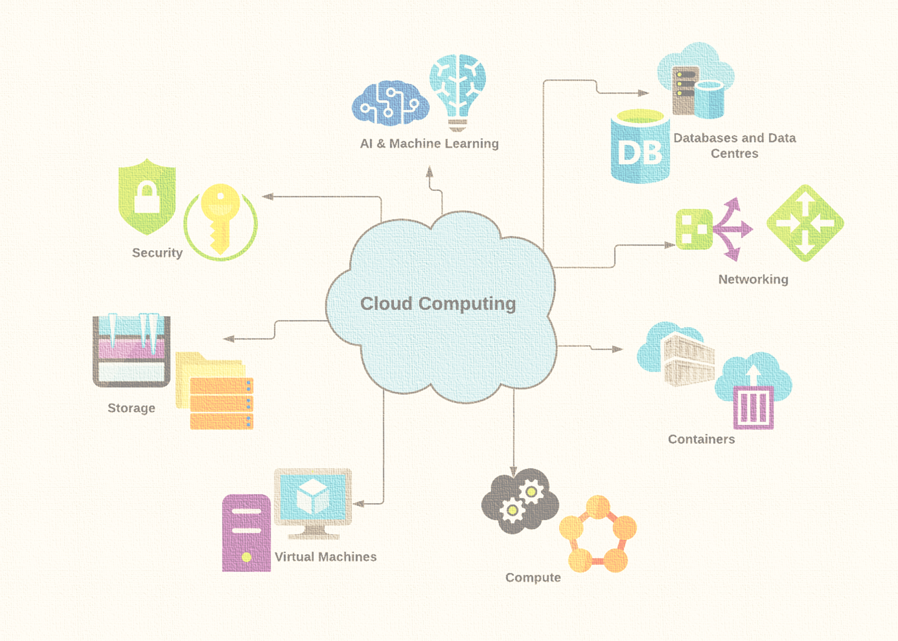

Udemy Course >> Network Administration + Networking Essentials Part 4

Network Administration + IT Computer Network Fundamentals + Theory + Network Engineering + Networking Essentials Part 3

**********

Topics:
- BYOD
- Online Collaboration
- Video Communications
- Cloud Computing

**********

Tips/Tricks/Notes/Commands URL Link: https://github.com/nimaxnimax/Udemy_Net_Admin_Essentials

Instructor & Courses >> https://www.udemy.com/user/adrian-fischer-infotech/

**********

BYOD

Bring Your Own Device (BYOD) is a business policy that allows employees to use their personal devices (such as smartphones, tablets, and laptops) to access company resources and perform work-related tasks. This trend has gained popularity in the workplace due to the proliferation of personal mobile devices and the desire for greater flexibility and convenience in the way people work.

Key aspects of BYOD include:

1. **Device Diversity:** BYOD accommodates a variety of devices, including smartphones, tablets, laptops, and sometimes even wearable devices. This diversity allows employees to choose the devices that they are most comfortable with and that best suit their needs.

2. **Employee Productivity:** BYOD is often seen as a way to enhance employee productivity. Employees can work from anywhere using their preferred devices, enabling a more flexible and mobile work environment. This flexibility can contribute to improved job satisfaction and work-life balance.

3. **Cost Savings:** BYOD can lead to cost savings for organizations as employees typically cover the costs of their devices. This can reduce the need for the company to invest in hardware, although organizations might need to implement security measures and support systems.

4. **Challenges and Security Concerns:** One of the primary challenges associated with BYOD is the potential security risks. Personal devices may not have the same security features as company-provided devices, making them more susceptible to malware, data breaches, and unauthorized access. To address these concerns, companies must implement robust security policies, including encryption, secure network access, and remote wipe capabilities.

5. **Data Privacy:** BYOD introduces concerns about data privacy, as personal and corporate data can coexist on the same device. Clear policies and practices are necessary to ensure that personal information remains private, and corporate data is adequately protected.

6. **Management and Support:** IT departments must manage and support a wide range of devices and operating systems, which can be challenging. Implementing Mobile Device Management (MDM) solutions and policies can help organizations maintain control over the devices and enforce security measures.

7. **Policy Development:** Successful implementation of BYOD requires a well-defined policy that outlines the rules and expectations for employees using their own devices for work. This policy should address security measures, acceptable use, support protocols, and consequences for non-compliance.

BYOD can offer numerous benefits in terms of flexibility and cost savings, but it also comes with challenges related to security, management, and privacy. Organizations considering BYOD should carefully plan and implement comprehensive policies and security measures to mitigate potential risks.

In the context of networking and network administration, the Bring Your Own Device (BYOD) trend introduces several important considerations and challenges. BYOD policies allow employees to use their personal devices in the workplace, creating a more flexible and mobile work environment. Here are key aspects that are important and related to BYOD in networking:

1. **Security:**
   - **Device Security Policies:** Network administrators must implement robust security policies to ensure that personal devices connecting to the network meet certain security standards. This may include requirements for antivirus software, device encryption, and regular security updates.

2. **Network Access Control (NAC):**
   - **Enforcing Access Policies:** Network Access Control solutions help administrators enforce policies that dictate which devices are allowed to connect to the network. NAC can be used to assess the security posture of devices before granting access.

3. **Mobile Device Management (MDM):**
   - **Managing Mobile Devices:** MDM solutions help administrators manage and control mobile devices accessing the network. This includes configuring security settings, enforcing policies, and remotely wiping devices in case of loss or theft.

4. **User Authentication:**
   - **Secure Authentication:** Implementing strong user authentication measures becomes crucial. This ensures that only authorized individuals can access the network, protecting against unauthorized access and potential security breaches.

5. **Network Segmentation:**
   - **Isolating BYOD Traffic:** Network segmentation involves creating isolated network segments for different types of traffic. This helps in segregating BYOD traffic from critical business systems, reducing the potential impact of security incidents.

6. **Guest Network Considerations:**
   - **Separate Guest Networks:** Creating separate guest networks for BYOD devices can enhance security. Guest networks typically have limited access to internal resources, minimizing the risk of unauthorized access.

7. **Policy Development:**
   - **BYOD Usage Policies:** Network administrators should collaborate with other stakeholders to develop clear BYOD usage policies. These policies should address security measures, acceptable use, support protocols, and consequences for non-compliance.

8. **Bandwidth Management:**
   - **Managing Bandwidth Usage:** The influx of personal devices can increase bandwidth usage. Network administrators must monitor and manage bandwidth effectively to ensure a smooth network experience for all users.

9. **Data Privacy:**
   - **Separating Personal and Corporate Data:** Clear policies and technologies should be in place to ensure the separation of personal and corporate data on BYOD devices. This is crucial for maintaining data privacy and compliance with regulations.

10. **Device Compatibility:**
    - **Supporting Various Devices:** BYOD introduces a diverse range of devices with different operating systems and capabilities. Network administrators must ensure that the network infrastructure can support the connectivity requirements of various devices.

11. **Remote Access:**
    - **Secure Remote Connections:** With BYOD, remote access to the corporate network becomes more prevalent. Network administrators should implement secure methods, such as Virtual Private Networks (VPNs), to facilitate remote connections while maintaining security.

12. **Compliance and Regulations:**
    - **Adhering to Regulations:** Network administrators need to ensure that BYOD policies and practices comply with industry regulations, data protection laws, and privacy requirements.

13. **Monitoring and Auditing:**
    - **Continuous Monitoring:** Regular monitoring and auditing of network activities help identify any anomalies or security breaches. This proactive approach can enhance the overall security posture of the network.

14. **User Education:**
    - **Security Awareness Training:** Providing user education and security awareness training is essential. Users should be aware of the risks associated with BYOD and understand their role in maintaining a secure network environment.

Effectively managing the integration of BYOD into the network requires a balance between enabling flexibility for users and maintaining robust security measures to protect sensitive corporate data. Network administrators play a pivotal role in establishing and enforcing policies that strike this balance while ensuring the integrity and security of the network.

Bring Your Own Device (BYOD) policies can bring numerous benefits to organizations, such as increased flexibility and employee satisfaction. However, they also introduce security challenges that need careful consideration. Here are key aspects to consider in BYOD, along with measures to enhance security:

Considerations in BYOD:

1. **Security Policies:**
   - Develop and enforce clear BYOD security policies outlining acceptable use, device configurations, and security best practices.

2. **Device Management:**
   - Implement Mobile Device Management (MDM) solutions to enforce security policies, remotely wipe devices in case of loss or theft, and ensure that devices meet security standards.

3. **User Authentication:**
   - Require strong user authentication methods, such as two-factor authentication, to ensure that only authorized individuals can access corporate resources.

4. **Network Access Control (NAC):**
   - Implement Network Access Control to assess the security posture of devices before granting access to the corporate network.

5. **Encryption:**
   - Enforce encryption on devices to protect data both in transit and at rest. This includes encrypting communication channels and implementing full-device encryption.

6. **Secure Containers:**
   - Consider using secure containers or virtualization to create isolated environments on devices, segregating corporate data from personal data.

7. **Remote Wipe and Lock:**
   - Ensure the ability to remotely wipe or lock a device if it is lost, stolen, or when an employee leaves the organization.

8. **Application Security:**
   - Vet and approve applications allowed on BYOD devices to prevent the installation of malicious or insecure apps. Encourage employees to download apps only from official app stores.

9. **Device Compatibility:**
   - Support a diverse range of devices, operating systems, and versions to accommodate the variety of devices employees may bring to the workplace.

10. **User Education:**
    - Provide comprehensive security awareness training to BYOD users, educating them on security risks, safe practices, and the importance of adhering to security policies.

11. **Legal and Compliance Considerations:**
    - Ensure that BYOD policies comply with legal regulations and industry standards related to data privacy and security.

12. **Monitoring and Auditing:**
    - Implement continuous monitoring and auditing to track device activities, identify security incidents, and ensure compliance with security policies.

13. **Incident Response Plan:**
    - Develop a clear incident response plan to address security breaches promptly. This includes communication protocols, investigation procedures, and recovery processes.

14. **Data Backup:**
    - Encourage or enforce regular data backups to prevent data loss in case of device failure, loss, or other unforeseen events.

15. **Vendor Assessment:**
    - If using third-party applications or services, assess the security practices of vendors and ensure they comply with security standards.

How to Secure BYOD:

1. **Policy Enforcement:**
   - Clearly define and enforce BYOD policies, covering aspects such as acceptable use, security configurations, and data protection.

2. **Employee Onboarding and Offboarding:**
   - Implement thorough processes for onboarding and offboarding employees, ensuring that devices are properly configured and secured during their entire lifecycle with the organization.

3. **Regular Security Audits:**
   - Conduct regular security audits to assess the effectiveness of BYOD security measures and identify areas for improvement.

4. **Security Updates:**
   - Promptly apply security updates and patches to both devices and the software used in the BYOD environment.

5. **Collaboration with IT and Security Teams:**
   - Foster collaboration between IT, security teams, and end-users to address security concerns and ensure that everyone is aware of their role in maintaining a secure BYOD environment.

6. **Continuous Education:**
   - Provide ongoing education and awareness programs to keep employees informed about the latest security threats and best practices.

7. **Privacy Protection:**
   - Respect employee privacy by clearly delineating between personal and corporate data on BYOD devices and establishing policies that protect personal information.

8. **Legal Agreements:**
   - Establish legal agreements with employees that outline their responsibilities and liabilities regarding the use of personal devices for work purposes.

By addressing these considerations and implementing security measures, organizations can create a more secure BYOD environment, allowing employees to enjoy the benefits of using their own devices while mitigating potential security risks. Regular review and adaptation of security practices are crucial in the dynamic landscape of BYOD.

Several applications and software solutions are specifically designed to address various aspects of Bring Your Own Device (BYOD) environments, helping organizations manage and secure the use of personal devices in the workplace. Here are some categories of applications and examples within each category:

Mobile Device Management (MDM) and Enterprise Mobility Management (EMM):

1. **VMware Workspace ONE:**
   - Offers comprehensive mobile device management, application management, and identity management capabilities.

2. **Microsoft Intune:**
   - Part of the Microsoft 365 suite, it provides MDM and mobile application management (MAM) features, helping organizations secure and manage mobile devices.

3. **MobileIron:**
   - Focuses on securing mobile devices and applications, offering features such as device management, app management, and secure content collaboration.

4. **Jamf Pro:**
   - Specifically designed for managing Apple devices in the enterprise, including Mac, iPhone, iPad, and Apple TV.

Secure Containerization and Application Virtualization:

1. **Samsung Knox Workspace:**
   - Provides a secure container for separating work and personal data on Android devices, ensuring corporate data is protected.

2. **Citrix Endpoint Management:**
   - Combines MDM and mobile application management with virtualization capabilities, allowing secure access to applications and data.

3. **Duo Mobile:**
   - Offers multi-factor authentication (MFA) to enhance the security of device access, especially when connecting to corporate resources.

Network Access Control (NAC) Solutions:

1. **Aruba ClearPass:**
   - Provides network access control and policy management, allowing organizations to enforce security policies for devices connecting to the network.

2. **Cisco Identity Services Engine (ISE):**
   - Offers policy-based access control and secure access to the network based on device and user identity.

Endpoint Security:

1. **Symantec Endpoint Protection:**
   - Combines antivirus, anti-malware, and firewall features to protect endpoints, including those associated with BYOD.

2. **McAfee Endpoint Security:**
   - Offers comprehensive endpoint protection, including threat prevention, firewall, and device control.

Collaboration and Productivity Tools:

1. **Microsoft 365 (formerly Office 365):**
   - Includes applications like Microsoft Teams, which supports collaboration and communication in a BYOD environment.

2. **Google Workspace (formerly G Suite):**
   - Offers cloud-based collaboration tools such as Google Drive, Google Docs, and Google Meet.

3. **Slack:**
   - A messaging and collaboration platform that facilitates communication among team members, including those using personal devices.

Virtual Private Network (VPN) Solutions:

1. **ExpressVPN:**
   - A VPN service that encrypts internet traffic, ensuring secure communication for remote employees accessing corporate resources from their personal devices.

2. **Cisco AnyConnect:**
   - Provides VPN capabilities, allowing secure remote access to corporate networks.

### Secure Web Browsers:

1. **DuckDuckGo Privacy Browser:**
   - A privacy-focused web browser for mobile devices that enhances user privacy by blocking trackers and providing encrypted connections.

2. **Brave:**
   - A web browser with built-in privacy features, offering improved security and protection against tracking.

These applications and solutions can contribute to creating a more secure and manageable BYOD environment. However, it's crucial for organizations to carefully evaluate and select the right combination of tools based on their specific requirements, security policies, and the types of devices used by employees. Additionally, regular updates and adherence to best practices in BYOD security are essential for maintaining a robust and secure environment.

**********

Online Collaboration

Online collaboration refers to the use of digital tools and platforms to facilitate teamwork and communication among individuals or groups located in different physical locations. This collaborative approach leverages technology to overcome geographical barriers, enabling people to work together, share information, and achieve common goals efficiently. Online collaboration has become increasingly prevalent in various professional and educational settings, transforming the way people interact and collaborate.

Key aspects of online collaboration include:

1. **Communication Tools:** Online collaboration relies on a variety of communication tools to facilitate real-time or asynchronous interaction. These tools include email, instant messaging, video conferencing, and collaborative platforms such as Slack, Microsoft Teams, and Zoom.

2. **Document Sharing and Collaboration:** Cloud-based document sharing and collaboration tools, such as Google Workspace (formerly G Suite) and Microsoft 365, allow users to create, edit, and share documents in real time. Multiple users can collaborate on the same document simultaneously, providing a seamless way to work together on projects.

3. **Project Management Platforms:** Online collaboration often involves project management platforms like Trello, Asana, or Jira. These tools help teams organize tasks, set deadlines, track progress, and ensure that everyone is on the same page regarding project objectives.

4. **Virtual Whiteboards and Mind Mapping:** Virtual whiteboards and mind mapping tools, such as Miro or MURAL, enable teams to brainstorm ideas, plan projects, and visualize concepts in a collaborative digital space.

5. **File Sharing and Storage:** Cloud-based file-sharing platforms like Dropbox, OneDrive, and Box facilitate the sharing and storage of files, making it easy for team members to access and collaborate on documents from anywhere with an internet connection.

6. **Social Collaboration Platforms:** Social collaboration platforms, such as Yammer or Workplace by Facebook, mimic social media environments within a professional context. These platforms encourage communication, knowledge sharing, and networking among team members.

7. **Web Conferencing and Virtual Meetings:** Online collaboration often involves virtual meetings and web conferencing tools, allowing team members to connect, discuss ideas, and make decisions in real time. Video conferencing platforms like Zoom, Microsoft Teams, and Cisco Webex have become essential for remote collaboration.

8. **Collaborative Editing:** Platforms like Google Docs and Microsoft Word Online enable multiple users to edit a document simultaneously, fostering real-time collaboration on text-based projects.

Benefits of online collaboration include increased flexibility, improved efficiency, enhanced communication, and the ability to bring together diverse talents from different locations. However, challenges such as security concerns, technological barriers, and the need for effective communication strategies must be addressed to ensure successful online collaboration experiences. Organizations and individuals can choose from a wide range of tools and platforms based on their specific needs and preferences.

In the context of networking and network administration, several important aspects are related to online collaboration tools and platforms. Online collaboration relies heavily on effective network infrastructure to facilitate communication and cooperation among individuals or groups. Here are key considerations:

1. **Bandwidth Management:**
   - **Sufficient Bandwidth:** Online collaboration tools, including video conferencing, document sharing, and real-time communication, require ample bandwidth. Network administrators must ensure that there is enough bandwidth to support multiple users engaging in collaborative activities simultaneously.

2. **Quality of Service (QoS):**
   - **Prioritizing Traffic:** Implementing QoS mechanisms helps prioritize online collaboration traffic, ensuring that essential communication tools have higher priority over less time-sensitive data. This helps maintain a consistent and reliable user experience.

3. **Network Latency and Jitter:**
   - **Low Latency:** Minimizing latency and jitter is crucial for real-time collaboration. Network administrators need to optimize the network to reduce delays in communication, especially during live collaboration sessions.

4. **Firewall Configuration:**
   - **Permitting Collaboration Traffic:** Firewalls must be configured to allow traffic generated by online collaboration tools to pass through. This involves opening the necessary ports and ensuring that security policies don't hinder the functionality of collaboration applications.

5. **Virtual Private Networks (VPNs):**
   - **Secure Remote Access:** Network administrators may implement VPNs to secure remote access to collaboration tools. This is especially important in situations where team members work from different locations.

6. **Network Monitoring:**
   - **Real-time Monitoring:** Network administrators need to monitor the network in real time to identify and address issues promptly. Monitoring tools can track bandwidth usage, latency, and other metrics to ensure optimal performance for online collaboration.

7. **Scalability:**
   - **Handling Increased Users:** As the number of users engaging in online collaboration increases, the network infrastructure must be scalable to accommodate additional traffic without sacrificing performance.

8. **Content Delivery Networks (CDNs):**
   - **Optimizing Content Delivery:** CDNs can be used to optimize the delivery of collaboration tools, ensuring that content and data are delivered efficiently, especially for geographically dispersed teams.

9. **Authentication and Access Control:**
   - **Secure Access:** Network administrators should implement robust authentication and access control measures to prevent unauthorized access to collaboration platforms and sensitive data.

10. **Device Compatibility:**
    - **Supporting Various Devices:** Collaboration tools often support various devices, including computers, tablets, and smartphones. Network administrators must ensure that the network infrastructure supports the connectivity and communication requirements of these devices.

11. **Software Updates and Patch Management:**
    - **Ensuring Compatibility:** Keeping network devices and software up-to-date is critical for compatibility with the latest features and security patches released by collaboration tool providers.

12. **Integration with Other Tools:**
    - **Seamless Integration:** Collaboration tools may integrate with other business applications and services. Network administrators should facilitate seamless integration by configuring the network to support the data flow between these systems.

13. **Backup and Recovery:**
    - **Data Integrity:** Implementing backup solutions is essential to ensure data integrity and availability in case of unexpected events. This is particularly important for collaboration tools where shared documents and information are stored.

14. **Security Compliance:**
    - **Adhering to Regulations:** Network administrators must ensure that online collaboration tools comply with industry regulations and security standards. This involves implementing security protocols and conducting regular audits.

By addressing these considerations, network administrators can contribute to a reliable and secure network infrastructure that supports seamless online collaboration for teams and organizations.

There are both open-source and proprietary (non-open source) software and applications available for online collaboration. Here's a list that includes examples from both categories:

Open Source Online Collaboration Tools:

1. **Nextcloud:**
   - An open-source, self-hosted platform for file sharing, collaboration, and communication. It includes features like file synchronization, document editing, and group chat.

2. **Jitsi Meet:**
   - An open-source video conferencing platform that allows users to set up and join video meetings without the need for accounts.

3. **Mattermost:**
   - An open-source team collaboration platform that offers messaging, file sharing, and integration capabilities. It is designed as an alternative to proprietary messaging platforms.

4. **ONLYOFFICE Community Edition:**
   - An open-source office suite that includes document editing, spreadsheet, and presentation tools. It can be integrated with collaboration platforms.

5. **Zulip:**
   - An open-source team chat application with a threaded conversation model, making it suitable for organized and focused communication.

6. **Rocket.Chat:**
   - An open-source team chat solution that supports real-time messaging, video conferencing, and file sharing.

7. **Etherpad:**
   - An open-source collaborative online editor that allows multiple users to work on a document simultaneously. It's suitable for real-time collaboration on plain text documents.

8. **BigBlueButton:**
   - An open-source web conferencing system designed for online learning and collaboration. It includes features like video conferencing, screen sharing, and real-time polling.

Proprietary (Non-Open Source) Online Collaboration Tools:

1. **Microsoft Teams:**
   - A collaboration platform within Microsoft 365 that integrates with other Microsoft Office applications, offering chat, video conferencing, and file sharing.

2. **Slack:**
   - A popular messaging and collaboration platform for teams, supporting channels, direct messages, and integrations with various third-party apps.

3. **Zoom:**
   - A widely used video conferencing platform that supports online meetings, webinars, and collaboration features such as screen sharing and breakout rooms.

4. **Google Workspace (formerly G Suite):**
   - A suite of cloud-based productivity and collaboration tools, including Gmail, Google Drive, Google Docs, and Google Meet.

5. **Cisco Webex:**
   - A collaboration platform that offers video conferencing, online meetings, and team collaboration features.

6. **Trello:**
   - A project management and collaboration tool that uses boards, lists, and cards to help teams organize and prioritize tasks.

7. **Asana:**
   - A project management and collaboration tool that enables teams to organize work, assign tasks, and track project progress.

8. **Adobe Creative Cloud:**
   - A suite of creative tools for collaboration on design and multimedia projects, including Photoshop, Illustrator, and Premiere Pro.

When choosing between open-source and proprietary tools, organizations should consider factors such as features, scalability, integration capabilities, support options, and budget constraints. Additionally, the specific needs and preferences of the users should be taken into account to ensure effective collaboration within the organization.

**********

Video Communications

Video communication refers to the use of video technology to facilitate real-time visual communication between individuals or groups located in different places. This form of communication has become increasingly popular for both personal and professional interactions, allowing people to connect, collaborate, and engage face-to-face without the need for physical presence. Video communication is commonly used for meetings, conferences, interviews, educational sessions, and social interactions.

Key elements of video communication include:

1. **Video Conferencing Platforms:** Video conferencing platforms enable individuals or groups to connect via video calls. These platforms often include features such as screen sharing, chat, and file sharing. Popular video conferencing tools include Zoom, Microsoft Teams, Cisco Webex, Google Meet, and Skype.

2. **Webcams:** Webcams are external or built-in cameras that capture video input for communication purposes. Many laptops, tablets, and external devices come equipped with webcams, providing a simple way to participate in video calls.

3. **Audio Equipment:** Clear and high-quality audio is essential for effective video communication. Users often use headsets, external microphones, or the built-in microphones on their devices to ensure that their voice is transmitted clearly during video calls.

4. **Internet Connectivity:** A stable and high-speed internet connection is crucial for smooth video communication. Insufficient bandwidth can lead to video and audio lag, pixelation, and interruptions during calls.

5. **Devices:** Video communication can be conducted on various devices, including desktop computers, laptops, tablets, and smartphones. The choice of device depends on the user's preferences and the specific requirements of the communication.

6. **Security Features:** As video communication involves transmitting sensitive information, security features such as encryption and secure meeting access are essential to protect the privacy of participants and prevent unauthorized access.

7. **Recording and Playback:** Many video communication platforms allow users to record video calls for later review or sharing. This feature is valuable for individuals who cannot attend a live session or for archiving purposes.

8. **Integration with Other Tools:** Video communication tools often integrate with other collaboration and productivity tools, such as email, calendars, and project management platforms, to streamline workflows and enhance the overall collaboration experience.

9. **Virtual Backgrounds and Filters:** Some video communication platforms offer features like virtual backgrounds and filters, allowing users to customize their video feed and add a layer of privacy or professionalism to their virtual environment.

Video communication offers several advantages, including the ability to convey non-verbal cues, build rapport, and enhance the overall communication experience. It has become especially crucial for remote work, enabling teams to stay connected and collaborate effectively across different locations. However, users must be mindful of potential challenges, such as technical issues, security concerns, and video conferencing fatigue.

In the context of networking and network administration, several aspects are important and related to video communications. Ensuring a robust and efficient network infrastructure is crucial for supporting the demands of video communication applications. Here are key considerations:

1. **Bandwidth Management:**
   - **High Bandwidth Requirements:** Video communication applications, especially those involving high-definition video or multiple participants, require significant bandwidth. Network administrators must ensure that there is enough bandwidth to support smooth video streaming without latency or interruptions.

2. **Quality of Service (QoS):**
   - **Prioritization:** QoS mechanisms allow network administrators to prioritize video traffic over other types of data. This ensures that video communications receive sufficient resources and are not negatively impacted by less time-sensitive traffic.

3. **Network Latency and Jitter:**
   - **Low Latency:** Video communication is sensitive to latency and jitter (variation in latency). Network administrators need to minimize these factors to provide a seamless and real-time experience for users.

4. **Firewall and Security:**
   - **Firewall Configuration:** Network administrators must configure firewalls to allow video communication traffic to pass through while maintaining security. This includes opening the necessary ports and ensuring that the firewall does not block video communication applications.

5. **Virtual Private Networks (VPNs):**
   - **Secure Remote Access:** In a scenario where remote users participate in video communications, network administrators may implement VPNs to ensure secure and encrypted connections over the internet.

6. **Content Delivery Networks (CDNs):**
   - **Optimizing Delivery:** CDNs can be employed to cache and deliver video content from servers located closer to end-users. This minimizes latency and enhances the overall video communication experience.

7. **Device Compatibility:**
   - **Networked Devices:** Network administrators need to ensure that the network infrastructure supports a variety of video communication devices, including webcams, video conferencing systems, and other peripherals.

8. **Network Monitoring:**
   - **Real-time Monitoring:** Implementing network monitoring tools helps administrators identify and address issues affecting video communication in real time. This includes monitoring bandwidth usage, latency, and other relevant metrics.

9. **Software Updates and Patch Management:**
   - **Ensuring Compatibility:** Keeping network devices and software up-to-date is crucial for ensuring compatibility with the latest video communication applications and protocols. Regular updates may include security patches and optimizations.

10. **Scalability:**
    - **Handling Increased Traffic:** As the demand for video communication grows, network administrators must ensure that the network infrastructure can scale to handle increased traffic without degradation in performance.

11. **Network Redundancy:**
    - **Minimizing Downtime:** Redundancy measures, such as failover configurations and redundant network paths, can help minimize downtime and ensure continuous video communication, even in the event of network failures.

12. **Collaboration Platforms Integration:**
    - **Integration with Collaboration Tools:** Video communication is often integrated with collaboration platforms. Network administrators may need to configure network settings to enable seamless integration between video communication applications and collaboration tools.

13. **Authentication and Access Control:**
    - **Secure Access:** Network administrators should implement secure authentication and access control measures to prevent unauthorized access to video communication resources and sensitive data.

By addressing these considerations, network administrators can contribute to a reliable and high-performance network infrastructure that supports the growing demand for video communication in both professional and personal settings.

Video communication and meeting solutions can be categorized into software and hardware solutions. Here are examples for both:

Video Communication and Meeting Software:

1. **Zoom:**
   - A widely-used video conferencing platform that supports online meetings, webinars, and virtual collaboration. It offers features like screen sharing, breakout rooms, and integration with other applications.

2. **Microsoft Teams:**
   - A collaboration platform within Microsoft 365 that includes video conferencing, chat, file sharing, and integration with Microsoft Office applications.

3. **Cisco Webex:**
   - A comprehensive video conferencing and collaboration platform that provides features such as HD video, screen sharing, and integration with third-party apps.

4. **Skype:**
   - A popular video calling and messaging application that allows users to make video and voice calls, send instant messages, and share files.

5. **Google Meet:**
   - Part of the Google Workspace (formerly G Suite), Google Meet is a video conferencing platform with features like HD video, screen sharing, and real-time collaboration on documents.

6. **GoToMeeting:**
   - A web conferencing and online meeting platform that offers features like screen sharing, chat, and the ability to schedule and host virtual meetings.

7. **BlueJeans by Verizon:**
   - A video conferencing platform that provides features like real-time chat, screen sharing, and HD video quality. It is often used for virtual meetings and webinars.

8. **Jitsi Meet:**
   - An open-source video conferencing platform that allows users to set up and join video meetings without the need for accounts. It can be self-hosted or used on Jitsi's servers.

Video Communication and Meeting Hardware:

1. **Poly Studio X Series:**
   - A video conferencing system that combines a camera, audio, and video conferencing capabilities in a single device. It's designed for small to medium meeting rooms.

2. **Logitech Rally:**
   - A modular video conferencing system with Ultra-HD imaging, beamforming microphones, and motorized pan-tilt-zoom (PTZ) camera for larger meeting spaces.

3. **Cisco Webex Room Series:**
   - A range of video conferencing systems designed for different room sizes, featuring high-quality cameras, speakers, and microphones for optimal audio and video communication.

4. **Zoom Rooms for Touch:**
   - Integrates with Zoom software and includes touch-enabled displays, cameras, and audio equipment to create collaborative meeting spaces.

5. **Crestron Flex Series:**
   - A line of video conferencing solutions designed to integrate with popular collaboration platforms, offering flexibility for various room sizes and configurations.

6. **Microsoft Surface Hub:**
   - An interactive display and collaboration device that integrates with Microsoft Teams, providing video conferencing, whiteboarding, and collaboration features.

7. **Yealink VC Series:**
   - A range of video conferencing endpoints that include cameras, microphones, and speakers, suitable for different meeting room sizes.

8. **Sony BRAVIA Professional Displays with Meeting Room Integration:**
   - Professional displays that can be integrated with various video conferencing solutions to create interactive and collaborative meeting spaces.

When selecting video communication and meeting solutions, organizations should consider factors such as scalability, features, ease of use, integration capabilities, and the specific needs of their users and meeting spaces. The choice between software and hardware solutions often depends on the organization's requirements and budget constraints.

**********

Cloud Computing

Cloud computing is a technology paradigm that involves the delivery of computing services, including computing power, storage, databases, networking, analytics, software, and intelligence, over the internet ("the cloud") to offer faster innovation, flexible resources, and economies of scale. In essence, it allows users to access and use computing resources without the need to own and maintain physical infrastructure.

Key characteristics of cloud computing include:

1. **On-Demand Self-Service:** Users can provision and manage computing resources as needed, without requiring human intervention from service providers.

2. **Broad Network Access:** Cloud services are accessible over the internet from various devices, such as laptops, smartphones, and tablets.

3. **Resource Pooling:** Cloud providers pool computing resources to serve multiple customers, optimizing resource utilization and efficiency.

4. **Rapid Elasticity:** Resources can be quickly scaled up or down based on demand, allowing for flexibility and cost optimization.

5. **Measured Service:** Cloud resources are metered, and users pay only for the resources they consume. This pay-as-you-go model offers cost efficiency.

Benefits of Cloud Computing:

1. **Cost Savings:**
   - **No Upfront Capital Expenses:** Cloud computing eliminates the need for organizations to invest in and maintain physical infrastructure, reducing upfront costs.

2. **Scalability:**
   - **Flexible Resource Scaling:** Cloud services allow organizations to scale resources up or down based on demand, ensuring optimal performance without over-provisioning.

3. **Flexibility and Agility:**
   - **Rapid Deployment:** Cloud computing enables rapid deployment of applications and services, reducing time-to-market for new products and services.

4. **Accessibility and Collaboration:**
   - **Anywhere Access:** Users can access cloud services from anywhere with an internet connection, fostering collaboration and remote work capabilities.

5. **Reliability and Availability:**
   - **High Uptime:** Leading cloud providers offer high levels of service availability and reliability, often exceeding what individual organizations can achieve with on-premises infrastructure.

6. **Security:**
   - **Professional Security Measures:** Cloud providers invest heavily in security measures, including encryption, access controls, and compliance certifications, enhancing the overall security posture.

7. **Automatic Updates:**
   - **Software Maintenance:** Cloud providers handle routine software updates and maintenance, ensuring that applications and services are up to date and secure.

8. **Global Reach:**
   - **Global Data Centers:** Cloud providers operate data centers worldwide, allowing organizations to deploy resources in various geographic locations to meet regional requirements and improve user experience.

9. **Innovation:**
   - **Access to Latest Technologies:** Cloud providers continuously introduce new technologies and services, allowing organizations to leverage the latest innovations without the need for significant internal investment.

10. **Disaster Recovery:**
    - **Built-In Redundancy:** Cloud services often come with built-in redundancy and backup capabilities, making disaster recovery planning more straightforward and reliable.

11. **Environmentally Friendly:**
    - **Resource Efficiency:** Cloud providers optimize resource usage, leading to energy efficiency and reduced environmental impact compared to traditional on-premises data centers.

Cloud computing has become a foundational technology for businesses of all sizes, offering a wide range of services that empower organizations to innovate, collaborate, and scale more efficiently. However, it's crucial for organizations to carefully consider their specific requirements, security considerations, and cost implications when adopting cloud services.

In networking and network administration, several aspects are closely related to cloud computing due to the integration of cloud services with traditional network environments. Here are key considerations:

1. **Network Connectivity:**
   - **Internet Connectivity:** Cloud computing heavily relies on internet connectivity. Network administrators must ensure robust and reliable internet connections to enable seamless access to cloud services.

2. **Bandwidth Management:**
   - **Sufficient Bandwidth:** Adequate bandwidth is essential for efficient communication between on-premises infrastructure and cloud services. Network administrators need to manage bandwidth effectively to support data transfer to and from the cloud.

3. **Wide Area Network (WAN):**
   - **Optimizing WAN:** Organizations with multiple locations may need to optimize their Wide Area Network (WAN) to ensure low-latency access to cloud resources. Technologies like SD-WAN (Software-Defined WAN) can enhance connectivity.

4. **Virtual Private Networks (VPNs):**
   - **Secure Connectivity:** VPNs play a crucial role in ensuring secure connectivity between on-premises networks and cloud environments, allowing for the creation of private, encrypted connections over the internet.

5. **Direct Connect Services:**
   - **Dedicated Connections:** Some cloud providers offer Direct Connect services, allowing organizations to establish dedicated, high-speed connections between their on-premises infrastructure and the cloud provider's data center.

6. **Network Security:**
   - **Perimeter Security:** Network administrators need to implement robust security measures at the network perimeter, including firewalls and intrusion prevention systems, to protect against unauthorized access and potential cyber threats.

7. **Subnetting and Addressing:**
   - **IP Addressing:** Network administrators must manage IP addressing schemes, ensuring compatibility and smooth communication between on-premises networks and cloud resources.

8. **Identity and Access Management:**
   - **Secure Authentication:** Effective identity and access management practices are essential to ensure secure authentication and authorization when users access cloud resources.

9. **Load Balancing:**
   - **Optimizing Traffic Distribution:** Load balancing is important for distributing network traffic efficiently, especially when dealing with cloud-based applications and services that may experience varying levels of demand.

10. **Monitoring and Visibility:**
    - **Network Monitoring Tools:** Network administrators should use monitoring tools to gain visibility into the performance of the network and cloud services, allowing for proactive issue detection and resolution.

11. **Hybrid Cloud Architecture:**
    - **Integrating On-Premises and Cloud Environments:** Many organizations adopt a hybrid cloud approach, integrating on-premises infrastructure with cloud services. Network administrators play a key role in managing the connectivity and communication between these environments.

12. **Data Encryption:**
    - **Secure Data Transmission:** To ensure the confidentiality of data transmitted between on-premises infrastructure and the cloud, network administrators may implement encryption protocols.

13. **Network Redundancy:**
    - **Ensuring High Availability:** Network redundancy measures, such as redundant network paths and failover configurations, help ensure high availability of network connectivity to cloud resources.

14. **Collaboration Platforms:**
    - **Unified Communications:** Collaboration tools often leverage cloud services. Network administrators should optimize the network to support unified communications, including video conferencing and real-time collaboration applications.

15. **Internet of Things (IoT):**
    - **IoT Integration:** With the rise of IoT devices, network administrators need to consider the integration of IoT data with cloud services for storage, processing, and analysis.

Effective network administration in a cloud-centric environment requires a holistic approach, encompassing traditional on-premises infrastructure and cloud services. Network administrators must adapt their practices to ensure the seamless integration, security, and optimal performance of hybrid network environments.

Cloud computing has become a fundamental technology for organizations, offering a wide range of advantages. Various cloud service providers cater to different needs, and each has its strengths. Here are some well-known cloud computing providers along with their advantages:

1. Amazon Web Services (AWS):

- **Advantages:**
  - **Comprehensive Services:** AWS offers a vast array of services, including computing power, storage, databases, machine learning, analytics, and more.
  - **Global Reach:** With data centers in multiple regions worldwide, AWS provides low-latency access to services from various geographic locations.
  - **Ecosystem and Marketplace:** AWS has a large ecosystem of partners and a marketplace where users can find and deploy third-party applications.

2. Microsoft Azure:

- **Advantages:**
  - **Integration with Microsoft Products:** Azure seamlessly integrates with Microsoft's ecosystem, including Windows Server, Active Directory, and Microsoft 365.
  - **Hybrid Cloud Capabilities:** Azure supports hybrid cloud deployments, allowing organizations to integrate on-premises infrastructure with the cloud.
  - **Enterprise Focus:** Azure provides a range of services catering to enterprise needs, including AI, IoT, and extensive compliance certifications.

3. Google Cloud Platform (GCP):

- **Advantages:**
  - **Data Analytics and Machine Learning:** GCP is known for its robust data analytics and machine learning services, making it suitable for organizations with advanced data needs.
  - **Global Network Infrastructure:** GCP's global network infrastructure offers low-latency and high-performance access to services from around the world.
  - **BigQuery:** GCP's fully-managed, serverless data warehouse solution is popular for analyzing large datasets.

4. IBM Cloud:

- **Advantages:**
  - **Enterprise-Grade Solutions:** IBM Cloud offers solutions tailored for enterprise requirements, including AI, blockchain, and hybrid cloud capabilities.
  - **Security and Compliance:** IBM Cloud places a strong emphasis on security and compliance, making it suitable for industries with stringent regulatory requirements.
  - **Quantum Computing:** IBM is actively involved in quantum computing research and provides access to quantum computing services.

5. Oracle Cloud:

- **Advantages:**
  - **Database Solutions:** Oracle Cloud is known for its robust database solutions, including Oracle Autonomous Database, which offers automated maintenance and tuning.
  - **Enterprise Applications:** Oracle Cloud provides cloud solutions for various enterprise applications, including ERP, CRM, and HCM.
  - **High-Performance Computing:** Oracle Cloud offers high-performance computing solutions for demanding workloads.

6. Alibaba Cloud:

- **Advantages:**
  - **Strong Presence in Asia:** Alibaba Cloud is a major player in the Asian market, offering services with a strong focus on China and other Asian regions.
  - **Elastic Computing:** Alibaba Cloud provides scalable and elastic computing resources to handle varying workloads efficiently.
  - **Global Expansion:** While rooted in Asia, Alibaba Cloud is expanding its global presence, with data centers in multiple regions.

Advantages of Cloud Computing in General:

1. **Scalability:**
   - Cloud services can be easily scaled up or down based on demand, allowing organizations to pay only for the resources they use.

2. **Cost Efficiency:**
   - Cloud computing eliminates the need for upfront infrastructure investments, and the pay-as-you-go model helps control costs.

3. **Flexibility and Agility:**
   - Cloud services provide flexibility in deploying and managing applications, fostering agility and quick adaptation to changing business needs.

4. **Accessibility:**
   - Cloud resources are accessible from anywhere with an internet connection, facilitating remote work and collaboration.

5. **Innovation:**
   - Cloud providers continually introduce new technologies and services, allowing organizations to leverage the latest innovations without heavy upfront investments.

6. **Security Measures:**
   - Leading cloud providers implement robust security measures, including encryption, access controls, and compliance certifications.

7. **Data Redundancy and Backup:**
   - Cloud providers often offer data redundancy and backup solutions, ensuring data integrity and availability.

8. **Global Reach:**
   - Cloud providers operate data centers worldwide, allowing organizations to deploy resources in various geographic locations to meet regional requirements.

When choosing a cloud provider, organizations should consider their specific needs, such as the type of services required, compliance requirements, and geographic considerations. Many organizations also adopt a multi-cloud or hybrid cloud strategy to leverage the strengths of multiple providers.

