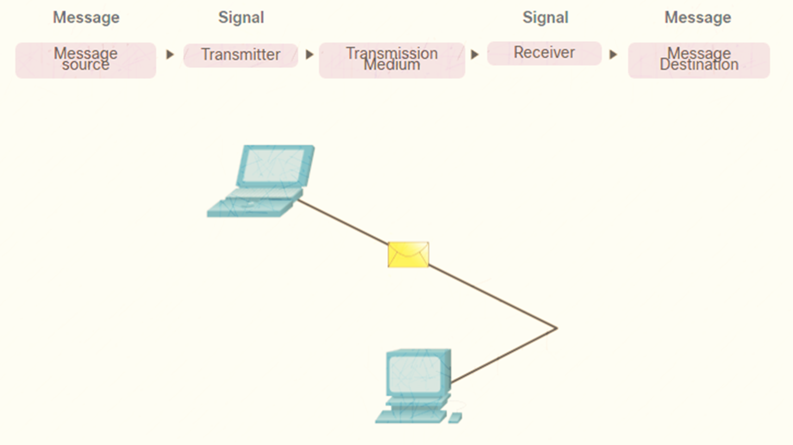
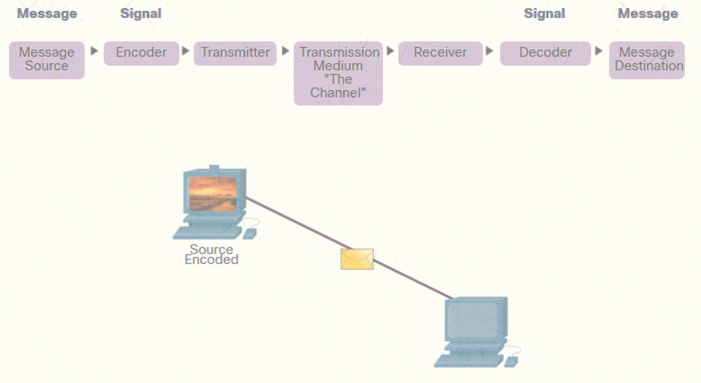
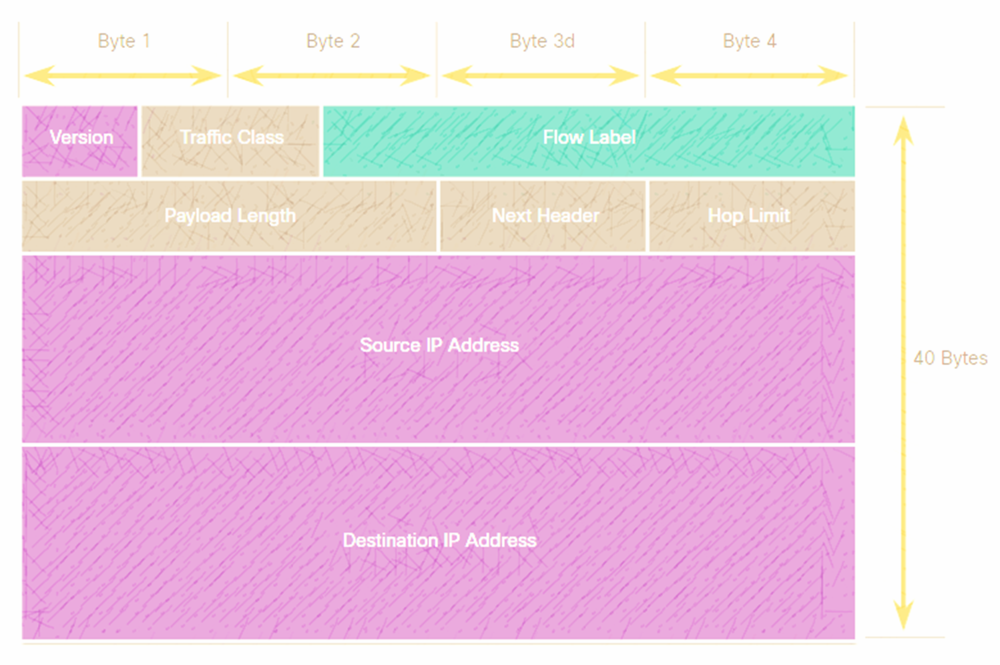
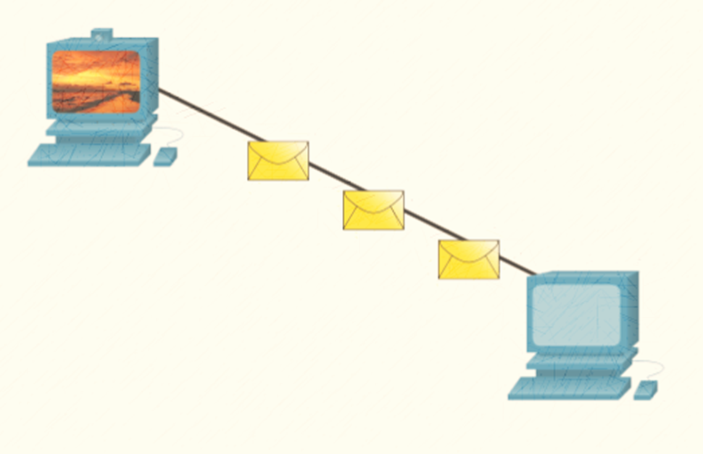
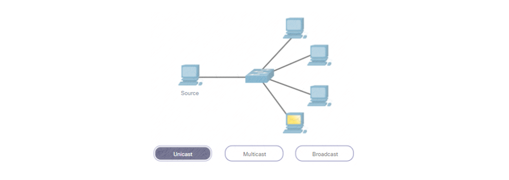

Udemy Course >> Network Administration + Networking Essentials Part 5

Network Administration + IT Computer Network Fundamentals + Theory + Network Engineering + Networking Essentials Part 5

**********

Topics:
- Communications Fundamentals
- Communications Protocols
- Rule Establishment
- Network Protocol Requirements
- Message Encoding
- Message Formatting and Encapsulation
- Message Size
- Message Timing
- Message Delivery Options

**********

Tips/Tricks/Notes/Commands URL Link: https://github.com/nimaxnimax/Udemy_Net_Admin_Essentials

Instructor & Courses >> https://www.udemy.com/user/adrian-fischer-infotech/

**********

Communications Fundamentals

Networks can vary in size and complexity. It is not enough to have a connection, devices must agree on “how” to communicate.

There are three elements to any communication:
- There will be a source (sender).
- There will be a destination (receiver).
- There will be a channel (media) that provides for the path of communications to occur.

**********

Communications Protocols
- All communications are governed by protocols.
- Protocols are the rules that communications will follow.
- These rules will vary depending on the protocol.

**********

Rule Establishment 

Protocols must account for the following requirements:
- An identified sender and receiver
- Common language and grammar
- Speed and timing of delivery
- Confirmation or acknowledgment requirements

**********

Network Protocol Requirements

Common computer protocols must be in agreement and include the following requirements: 
- Message encoding
- Message formatting and encapsulation
- Message size
- Message timing
- Message delivery options

**********

Message Encoding
- Encoding is the process of converting information into another acceptable form for transmission. 
- Decoding reverses this process to interpret the information. 

**********

Message Formatting and Encapsulation
- When a message is sent, it must use a specific format or structure. 
- Message formats depend on the type of message and the channel that is used to deliver the message. 

**********

Message Size

Encoding between hosts must be in an appropriate format for the medium.
- Messages sent across the network are converted to bits
- The bits are encoded into a pattern of light, sound, or electrical impulses.
- The destination host must decode the signals to interpret the message.

**********

Message Timing

Message timing includes the following: 
- Flow Control – Manages the rate of data transmission and defines how much information can be sent and the speed at which it can be delivered.
- Response Timeout – Manages how long a device waits when it does not hear a reply from the destination.
- Access method - Determines when someone can send a message. There may be various rules governing issues like “collisions”. This is when more than one device sends traffic at the same time and the messages become corrupt. Some protocols are proactive and attempt to prevent collisions; other protocols are reactive and establish a recovery method after the collision occurs.

**********

Message Delivery Options

Message delivery may one of the following methods: 
- Unicast – one to one communication
- Multicast – one to many, typically not all
- Broadcast – one to all

Note: Broadcasts are used in IPv4 networks, but are not an option for IPv6. Later we will also see “Anycast” as an additional delivery option for IPv6.

**********

**********

