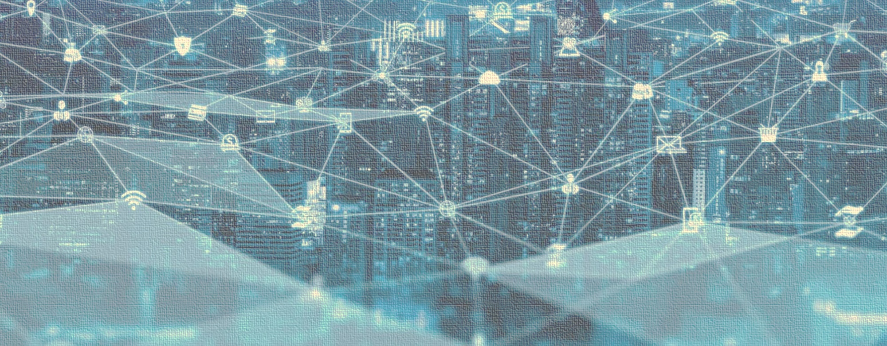

Udemy Course >> Network Administration + Networking Essentials Part 5

Network Administration + IT Computer Network Fundamentals + Theory + Network Engineering + Networking Essentials Part 5

**********

Topics:
- Communications Fundamentals
- Communications Protocols
- Rule Establishment
- Network Protocol Requirements
- Message Encoding
- Message Formatting and Encapsulation
- Message Size
- Message Timing
- Message Delivery Options

**********

Tips/Tricks/Notes/Commands URL Link: https://github.com/nimaxnimax/Udemy_Net_Admin_Essentials

Instructor & Courses >> https://www.udemy.com/user/adrian-fischer-infotech/

**********

Communications Fundamentals

Networks can vary in size and complexity. It is not enough to have a connection, devices must agree on “how” to communicate.

There are three elements to any communication:
- There will be a source (sender).
- There will be a destination (receiver).
- There will be a channel (media) that provides for the path of communications to occur.

**********

Communications Protocols
- All communications are governed by protocols.
- Protocols are the rules that communications will follow.
- These rules will vary depending on the protocol.

**********

Rule Establishment 

Protocols must account for the following requirements:
- An identified sender and receiver
- Common language and grammar
- Speed and timing of delivery
- Confirmation or acknowledgment requirements

**********

Network Protocol Requirements

Common computer protocols must be in agreement and include the following requirements: 
- Message encoding
- Message formatting and encapsulation
- Message size
- Message timing
- Message delivery options

**********

Message Encoding
- Encoding is the process of converting information into another acceptable form for transmission. 
- Decoding reverses this process to interpret the information. 

**********

Message Formatting and Encapsulation
- When a message is sent, it must use a specific format or structure. 
- Message formats depend on the type of message and the channel that is used to deliver the message. 

**********

Message Size

Encoding between hosts must be in an appropriate format for the medium.
- Messages sent across the network are converted to bits
- The bits are encoded into a pattern of light, sound, or electrical impulses.
- The destination host must decode the signals to interpret the message.

**********

Message Timing

Message timing includes the following: 
- Flow Control – Manages the rate of data transmission and defines how much information can be sent and the speed at which it can be delivered.
- Response Timeout – Manages how long a device waits when it does not hear a reply from the destination.
- Access method - Determines when someone can send a message. There may be various rules governing issues like “collisions”. This is when more than one device sends traffic at the same time and the messages become corrupt. Some protocols are proactive and attempt to prevent collisions; other protocols are reactive and establish a recovery method after the collision occurs.

**********

Message Delivery Options

Message delivery may one of the following methods: 
- Unicast – one to one communication
- Multicast – one to many, typically not all
- Broadcast – one to all

Note: Broadcasts are used in IPv4 networks, but are not an option for IPv6. Later we will also see “Anycast” as an additional delivery option for IPv6.

**********

More Information >> 
Communications Fundamentals

Let's delve deeper into the fundamentals of communication and networks:

1. **Communication Elements:**
   - **Source (Sender):** The source is the entity that initiates the communication process. It generates the information or data that needs to be transmitted to the destination. In a network context, the source can be a device such as a computer, server, or any other information-generating entity.

   - **Destination (Receiver):** The destination is the entity that receives the information transmitted by the source. Like the source, the destination can be a device or system capable of interpreting and processing the received information.

   - **Channel (Media):** The channel, also known as the communication medium, is the physical or logical path through which the data travels from the source to the destination. It can take various forms, including wired or wireless connections, optical fibers, radio waves, or any other means of transmitting signals. The choice of the channel depends on factors such as distance, data rate, and environmental conditions.

2. **Communication Process:**
   - **Encoding and Decoding:** As mentioned earlier, communication involves encoding information at the source and decoding it at the destination. This ensures that the information is represented in a format that can be efficiently transmitted over the chosen channel and then correctly interpreted by the receiving end.

   - **Protocols:** Devices must agree on "how" to communicate, and this is achieved through communication protocols. Protocols define the rules and conventions that govern the format and sequence of messages exchanged between devices. Common examples include the Transmission Control Protocol (TCP) and Internet Protocol (IP) used in the Internet.

   - **Data Transmission:** The actual transmission of data involves breaking information into smaller units called packets. These packets are sent over the network and reassembled at the destination. The reliability and efficiency of data transmission are crucial considerations in designing communication systems.

3. **Network Variability:**
   - **Size and Complexity:** Networks can vary widely in terms of size and complexity. Local Area Networks (LANs) typically cover a small geographic area, like a single building or campus. Wide Area Networks (WANs) cover larger geographic areas, often connecting LANs across different locations. The Internet is a global network that connects millions of devices worldwide.

   - **Topology:** Networks can have different topologies, such as bus, ring, star, or mesh. The topology affects how devices are interconnected and influences factors like reliability, scalability, and ease of maintenance.

   - **Scalability and Performance:** Networks should be scalable to accommodate growth in the number of devices and the volume of data traffic. Performance considerations involve factors like bandwidth, latency, and throughput, which impact the speed and efficiency of data transmission.

Understanding these fundamental elements and principles is essential for designing and managing effective communication systems and networks. It ensures that devices can reliably exchange information, leading to efficient and robust communication infrastructures.

**********

More Information >> 
Communications Protocols

Let's delve deeper into the concept of communications protocols:

1. **Definition of Communications Protocols:**
   - **Governance of Communications:** Communications protocols serve as a set of rules or standards that dictate how data is transmitted and received between devices in a network. They define the format, sequence, error checking, and other aspects of the communication process.

   - **Universal Standards:** Protocols ensure that devices from different manufacturers and running different software can communicate effectively. They provide a common language that devices can understand, facilitating interoperability in diverse network environments.

2. **Key Characteristics of Communications Protocols:**
   - **Format and Structure:** Protocols specify the format and structure of data exchanged between devices. This includes details like the order of data fields, the size of each field, and the overall structure of messages.

   - **Error Handling:** Protocols often include mechanisms for detecting and correcting errors that may occur during data transmission. This is crucial for ensuring the reliability of communication in the presence of noise, interference, or other issues.

   - **Flow Control:** To manage the pace of data transmission between devices, protocols may incorporate flow control mechanisms. These mechanisms prevent a fast sender from overwhelming a slower receiver with data.

   - **Addressing and Routing:** Protocols define how devices are addressed and how data is routed through a network. This is particularly important in larger networks where data may need to traverse multiple devices to reach its destination.

   - **Security:** Some protocols include provisions for securing communication, such as encryption and authentication. These security features are essential for protecting sensitive information from unauthorized access or tampering.

3. **Types of Communications Protocols:**
   - **Internet Protocols:** The Internet relies on a set of protocols known as the Internet Protocol Suite. Key components include the Transmission Control Protocol (TCP) for reliable data transmission and the Internet Protocol (IP) for addressing and routing.

   - **Application Layer Protocols:** Protocols at the application layer govern specific types of communication, such as email (SMTP, POP3), web browsing (HTTP), file transfer (FTP), and more. These protocols define how applications interact over a network.

   - **Wireless Protocols:** In wireless communications, protocols like Wi-Fi (802.11) and Bluetooth define how devices establish connections, exchange data, and manage resources in a wireless environment.

   - **Data Link Layer Protocols:** Protocols at the data link layer, such as Ethernet and Point-to-Point Protocol (PPP), govern communication between directly connected devices over a physical link.

4. **Protocol Stacks:**
   - **Layered Structure:** Protocols are often organized into a layered structure, known as a protocol stack. Each layer in the stack is responsible for specific aspects of communication. The OSI (Open Systems Interconnection) model and the TCP/IP model are common frameworks that illustrate these layers.

   - **Modularity and Interoperability:** A layered approach allows for modularity, making it easier to develop, update, and replace individual protocols without affecting the entire communication system. It also enhances interoperability by promoting compatibility between different devices and systems.

Communications protocols are the fundamental building blocks of networked communication. They establish the rules and standards that devices must follow to ensure effective and reliable data transmission across diverse network environments. The evolution of protocols continues to be integral to the development of efficient and secure communication systems.

**********

More Information >> 
Rule Establishment

When it comes to rule establishment in communication protocols, several critical requirements must be considered. Let's delve into each of these requirements:

1. **Identified Sender and Receiver:**
   - **Addressing:** Protocols need to establish a method for uniquely identifying the sender and receiver of messages. This often involves using addresses or identifiers. In network communications, devices are assigned unique IP addresses or hardware addresses (MAC addresses) for identification.

   - **Source and Destination Information:** The protocol specifies how sender and receiver information is included in the communication. This ensures that the message reaches the intended destination and that the recipient can identify the source of the information.

2. **Common Language and Grammar:**
   - **Data Format:** Protocols define the format in which data is represented for transmission. This includes specifying the size and structure of data fields, the order of information, and any encoding or compression schemes used.

   - **Syntax Rules:** The protocol establishes syntax rules that dictate how messages should be constructed. Adhering to a common syntax ensures that both the sender and receiver understand the structure of the data being exchanged.

   - **Data Encoding:** Protocols may include rules for encoding data, particularly in binary form. This ensures that data is represented consistently across different devices and systems.

3. **Speed and Timing of Delivery:**
   - **Data Rate:** The protocol specifies the speed or data rate at which information is transmitted. This is crucial for determining how quickly data can be sent and received. It's particularly important in scenarios where real-time communication or low-latency is required.

   - **Timing Synchronization:** Protocols may define mechanisms for synchronization to ensure that the sender and receiver are operating at the same pace. This synchronization is crucial for avoiding data loss, corruption, or misinterpretation.

4. **Confirmation or Acknowledgment Requirements:**
   - **Acknowledgment Mechanisms:** Protocols often include mechanisms for confirming the successful receipt of data. This may involve the recipient sending an acknowledgment message back to the sender. Acknowledgments enhance the reliability of communication by providing feedback on the status of transmitted data.

   - **Error Handling:** In addition to acknowledgments, protocols may define procedures for error detection and correction. Error-handling mechanisms are crucial for ensuring the integrity of the transmitted data, especially in environments where noise, interference, or other issues may lead to errors.

   - **Retry and Recovery:** Protocols may specify how to handle situations where data transmission fails or errors occur. This can include procedures for retransmitting data or implementing recovery mechanisms to recover from communication failures.

The establishment of rules in communication protocols is essential for ensuring effective, reliable, and standardized communication between devices. These rules address key aspects such as sender and receiver identification, language and grammar for data representation, speed and timing considerations, and acknowledgment mechanisms to enhance the robustness of communication systems.

**********

More Information >> 
Network Protocol Requirements

When it comes to rule establishment in communication protocols, several critical requirements must be considered. Let's delve into each of these requirements:

1. **Identified Sender and Receiver:**
   - **Addressing:** Protocols need to establish a method for uniquely identifying the sender and receiver of messages. This often involves using addresses or identifiers. In network communications, devices are assigned unique IP addresses or hardware addresses (MAC addresses) for identification.

   - **Source and Destination Information:** The protocol specifies how sender and receiver information is included in the communication. This ensures that the message reaches the intended destination and that the recipient can identify the source of the information.

2. **Common Language and Grammar:**
   - **Data Format:** Protocols define the format in which data is represented for transmission. This includes specifying the size and structure of data fields, the order of information, and any encoding or compression schemes used.

   - **Syntax Rules:** The protocol establishes syntax rules that dictate how messages should be constructed. Adhering to a common syntax ensures that both the sender and receiver understand the structure of the data being exchanged.

   - **Data Encoding:** Protocols may include rules for encoding data, particularly in binary form. This ensures that data is represented consistently across different devices and systems.

3. **Speed and Timing of Delivery:**
   - **Data Rate:** The protocol specifies the speed or data rate at which information is transmitted. This is crucial for determining how quickly data can be sent and received. It's particularly important in scenarios where real-time communication or low-latency is required.

   - **Timing Synchronization:** Protocols may define mechanisms for synchronization to ensure that the sender and receiver are operating at the same pace. This synchronization is crucial for avoiding data loss, corruption, or misinterpretation.

4. **Confirmation or Acknowledgment Requirements:**
   - **Acknowledgment Mechanisms:** Protocols often include mechanisms for confirming the successful receipt of data. This may involve the recipient sending an acknowledgment message back to the sender. Acknowledgments enhance the reliability of communication by providing feedback on the status of transmitted data.

   - **Error Handling:** In addition to acknowledgments, protocols may define procedures for error detection and correction. Error-handling mechanisms are crucial for ensuring the integrity of the transmitted data, especially in environments where noise, interference, or other issues may lead to errors.

   - **Retry and Recovery:** Protocols may specify how to handle situations where data transmission fails or errors occur. This can include procedures for retransmitting data or implementing recovery mechanisms to recover from communication failures.

The establishment of rules in communication protocols is essential for ensuring effective, reliable, and standardized communication between devices. These rules address key aspects such as sender and receiver identification, language and grammar for data representation, speed and timing considerations, and acknowledgment mechanisms to enhance the robustness of communication systems.

**********

More Information >> 
Network Protocol Requirements

Network protocol requirements are essential to ensure that devices and systems can communicate effectively within a network. Let's explore each of the specified requirements in more detail:

1. **Message Encoding:**
   - **Definition:** Message encoding involves converting information into a format suitable for transmission over a network. This ensures that the data is represented in a standardized way that can be understood by both the sender and the receiver.

   - **Common Encoding Schemes:** Protocols need to define the encoding schemes used for data representation. Common examples include binary encoding, ASCII (text encoding), and various compression algorithms. Agreement on encoding schemes ensures that devices interpret data consistently.

   - **Compatibility:** Devices communicating over a network must support the same encoding standards to exchange information accurately. Misalignment in encoding schemes can lead to misinterpretation of data.

2. **Message Formatting and Encapsulation:**
   - **Data Structure:** Protocols specify how data is structured and formatted for transmission. This includes details such as the order of data fields, the presence of headers or trailers, and any encapsulation mechanisms used.

   - **Encapsulation:** Many protocols use encapsulation to wrap data in a standardized format. This includes adding headers and trailers to the original data, providing information about the message, such as source and destination addresses, error-checking codes, and other relevant details.

   - **Compatibility:** Consistent formatting and encapsulation ensure that devices at both ends of a communication link can understand and process the transmitted data correctly.

3. **Message Size:**
   - **Maximum Transmission Unit (MTU):** Protocols define the maximum size of a message that can be transmitted in a single packet. This is often referred to as the Maximum Transmission Unit (MTU). It helps optimize data transmission by breaking larger messages into smaller, manageable units.

   - **Fragmentation and Reassembly:** If a message exceeds the MTU, protocols may include mechanisms for fragmenting the message into smaller packets for transmission. At the receiving end, these fragments are reassembled to reconstruct the original message.

   - **Efficiency and Performance:** Determining an appropriate message size is critical for optimizing network efficiency, minimizing overhead, and ensuring timely delivery of data.

4. **Message Timing:**
   - **Synchronization:** Protocols define the timing aspects of communication, ensuring that devices are synchronized in terms of when to send, receive, and process messages. This is crucial for avoiding issues such as data collisions and ensuring smooth communication.

   - **Timeouts and Retransmission:** Timing considerations also include defining timeout periods for waiting for acknowledgments or responses. Protocols may specify rules for retransmitting data if acknowledgments are not received within a specified timeframe.

   - **Real-time Requirements:** Some applications and systems have real-time communication requirements, where timing is critical for tasks such as video streaming, voice communication, or control systems.

5. **Message Delivery Options:**
   - **Reliability:** Protocols must address the reliability of message delivery. This involves defining mechanisms for error detection, correction, and acknowledgment. Reliable delivery is crucial for ensuring the integrity of transmitted data.

   - **Delivery Modes:** Protocols may support different delivery modes, such as unicast (one-to-one), multicast (one-to-many), or broadcast (one-to-all). The choice of delivery mode depends on the specific requirements of the communication scenario.

   - **Quality of Service (QoS):** In some cases, protocols may incorporate features to support Quality of Service, allowing users to prioritize certain types of traffic or ensure a certain level of performance for critical applications.

Network protocol requirements are fundamental for establishing effective communication within a network. The agreed-upon standards for message encoding, formatting, size, timing, and delivery options ensure that devices can seamlessly exchange information while adhering to common rules and conventions. These requirements are crucial for the interoperability and reliability of networked systems.

**********

More Information >> 
Message Encoding

Message encoding is a fundamental concept in communication systems, and it plays a crucial role in transmitting information between different entities, such as computers, devices, or individuals. Here's a more detailed explanation:

1. **Purpose of Encoding:**
   - **Efficient Transmission:** The primary purpose of encoding is to facilitate the efficient transmission of information. Different systems or devices may have varying formats for representing data, and encoding helps in converting the original information into a standardized format that can be easily transmitted and understood by the receiving end.

   - **Error Detection and Correction:** Encoding techniques often include error-detection and error-correction mechanisms. By using encoding schemes that incorporate redundancy or error-checking codes, the system can detect and sometimes correct errors that may occur during transmission.

   - **Compression:** Encoding can also involve compression techniques to reduce the size of the information being transmitted. This is particularly important in scenarios where bandwidth or storage capacity is limited.

2. **Common Encoding Methods:**
   - **Binary Encoding:** In many digital communication systems, information is encoded into binary code, where each bit represents a binary digit (0 or 1). This is the basis for most digital communication, including computer systems and the Internet.

   - **ASCII (American Standard Code for Information Interchange):** Used for encoding text characters, ASCII assigns a unique numerical value to each character, making it possible to represent text in a format that can be easily transmitted and understood by different systems.

   - **Image and Video Encoding:** Formats like JPEG (Joint Photographic Experts Group) and MPEG (Moving Picture Experts Group) are commonly used for encoding images and videos, respectively. These formats employ compression techniques to reduce file sizes while maintaining acceptable quality.

   - **Audio Encoding:** Audio information is often encoded using formats like MP3 (MPEG Audio Layer III) or AAC (Advanced Audio Coding). These formats use compression algorithms to reduce the size of audio files without significant loss of quality.

3. **Decoding:**
   - **Reverse Process:** Decoding is the process of converting the encoded information back to its original form. It takes place at the receiving end of the communication system.

   - **Interpretation:** The decoded information is interpreted and used by the receiving entity, whether it's a human, a computer, or another device.

   - **Error Handling:** In some cases, the decoding process may involve error detection and correction to ensure the accuracy of the received information.

Message encoding is a crucial aspect of communication systems, ensuring that information is efficiently and accurately transmitted between different entities. The choice of encoding method depends on the type of information being transmitted and the requirements of the communication system.

**********

More Information >> 
Message Formatting and Encapsulation

Message formatting and encapsulation are crucial aspects of communication protocols, ensuring that data is organized, structured, and transmitted in a standardized way. Let's explore these concepts in more detail:

1. **Message Formatting:**
   - **Definition:** Message formatting refers to the arrangement and organization of data in a specific structure before transmission. It involves determining how the data is represented, what type of information is included, and the order in which it is presented.

   - **Content and Structure:** The content of a message and the way it is structured depend on the type of information being communicated. For example, a message containing text may have a different format than a message containing multimedia data. The format is often defined by the communication protocol in use.

   - **Data Fields:** Messages typically consist of various data fields, each serving a specific purpose. These fields may include headers, which provide information about the message, and payload, which contains the actual data.

   - **Example:** In the context of an email protocol like SMTP (Simple Mail Transfer Protocol), the message format includes fields such as "From," "To," "Subject," and the actual message body. Each field has a specific format and placement within the overall message structure.

2. **Encapsulation:**
   - **Definition:** Encapsulation involves wrapping the data to be transmitted in a specific format or structure. This wrapping includes adding headers, trailers, or other control information to the original data, creating a complete unit or packet for transmission.

   - **Headers and Trailers:** Headers contain metadata about the message, such as source and destination addresses, message length, and control information. Trailers often include error-checking codes or other information for ensuring the integrity of the transmitted data.

   - **Benefits of Encapsulation:**
      - **Addressing:** Encapsulation allows for the inclusion of addressing information, ensuring that the message reaches the intended recipient.
      - **Error Detection and Correction:** Control information in headers and trailers facilitates error detection and correction mechanisms, enhancing the reliability of data transmission.
      - **Routing Information:** Protocols can include information about how the message should be routed through the network, especially in cases where the message needs to pass through multiple devices.

   - **Example:** In the Transmission Control Protocol (TCP) of the TCP/IP protocol suite, data is encapsulated into TCP segments. Each segment includes a header with source and destination port numbers, sequence numbers, and other control information, along with the actual data payload.

3. **Dependencies on Message Type and Channel:**
   - **Message Type:** Different types of messages may require different formatting. For example, a video streaming protocol may have a specific format for video data, while a file transfer protocol may have a different format for file-related information.

   - **Communication Channel:** The choice of communication channel also influences message formatting. Wired and wireless channels may have different considerations, and the protocol must define the format to ensure effective transmission over the chosen medium.

   - **Standardization:** Standardizing message formats based on message type and communication channel is crucial for ensuring interoperability and seamless communication between devices and systems.

Message formatting and encapsulation are essential components of communication protocols. They determine how data is organized, how additional information is added for transmission, and how the message is structured for delivery. These aspects play a vital role in the reliable and efficient exchange of information in various communication scenarios.

**********

More Information >> 
Message Size

Let's explore the concept of message size in the context of network communication and how encoding plays a role in the transmission of messages:

1. **Message Size:**
   - **Definition:** Message size refers to the amount of data contained in a single message or transmission unit. It is an important consideration in network communication as it influences factors such as transmission efficiency, network utilization, and the reliability of data transfer.

   - **Maximum Transmission Unit (MTU):** In networking, the Maximum Transmission Unit (MTU) is a key parameter related to message size. It represents the maximum size of a single data unit that can be transmitted over a network. When sending messages, particularly over the Internet, the data is often divided into smaller packets, each adhering to the MTU of the network.

   - **Fragmentation and Reassembly:** If a message is larger than the MTU, it may need to be fragmented into smaller packets for transmission. At the receiving end, these fragments are reassembled to reconstruct the original message. Efficient handling of fragmentation and reassembly is crucial for maintaining the integrity of the transmitted data.

   - **Efficiency Considerations:** Determining an appropriate message size is a trade-off between efficiency and overhead. Larger messages may lead to more efficient use of bandwidth, but they also introduce challenges related to fragmentation and potential delays in transmission. Smaller messages may result in higher overhead due to headers and control information associated with each packet.

2. **Encoding and Transmission:**
   - **Conversion to Bits:** Before transmission, messages are converted into a digital format, represented by a sequence of bits (binary digits). This process is known as encoding, and it ensures that the information is in a form that can be easily transmitted and processed by digital systems.

   - **Physical Transmission Mediums:** The bits are then encoded into physical signals appropriate for the transmission medium. For example:
      - **Wired Media:** In wired communication, bits are typically encoded into electrical voltage levels or light pulses (for fiber optics).
      - **Wireless Media:** In wireless communication, bits are encoded into radio waves, microwaves, or infrared signals.

   - **Decoding at the Destination:** The destination host must decode the received signals to interpret the original message. This involves reversing the encoding process, converting the transmitted signals back into bits and then interpreting the message based on the agreed-upon communication protocol.

3. **Significance of Medium and Encoding:**
   - **Medium-Specific Considerations:** Different transmission mediums have unique characteristics, and encoding methods are tailored to suit these mediums. For instance, the encoding used for fiber optic cables may differ from that used for copper cables or wireless communication.

   - **Signal Integrity:** The choice of encoding also influences the integrity of the transmitted signals. Different encoding schemes may have varying levels of resistance to noise, interference, and signal degradation.

   - **Bandwidth Utilization:** The efficiency of encoding impacts the utilization of available network bandwidth. Efficient encoding ensures that more information can be transmitted in a given time, optimizing the use of network resources.

Message size is a critical consideration in network communication, and it involves determining the appropriate size of data units for transmission. Encoding plays a key role in preparing messages for transmission by converting them into a digital format and encoding them into physical signals suitable for the chosen communication medium. Efficient encoding and decoding processes are essential for the reliable and accurate exchange of information across networks.

**********

More Information >> 
Message Timing

Message timing is a critical aspect of communication protocols, governing the timing and sequencing of data transmission in a network. Let's explore the key components of message timing:

1. **Flow Control:**
   - **Definition:** Flow control is a mechanism that manages the rate of data transmission between devices. It ensures that the sender does not overwhelm the receiver with data, preventing data loss, congestion, or buffer overflow at the receiving end.

   - **Regulating Transmission Speed:** Flow control mechanisms regulate the speed at which data is sent from the sender to the receiver. This can involve techniques such as windowing in the Transmission Control Protocol (TCP), where the sender adjusts the number of unacknowledged packets allowed in transit.

   - **Congestion Avoidance:** Flow control helps prevent congestion in the network by adjusting the transmission rate based on the capacity of the network and the ability of the receiver to process incoming data.

2. **Response Timeout:**
   - **Definition:** Response timeout is a feature that manages the time a device waits for a reply or acknowledgment from the destination after sending a message. If a response is not received within the specified time frame, the sender may take corrective actions, such as retransmitting the message.

   - **Timeout Values:** Protocols define timeout values based on factors such as network latency, the expected round-trip time for messages, and the specific requirements of the application. Shorter timeouts may be used for real-time communication, while longer timeouts are suitable for less time-sensitive applications.

   - **Reliability Enhancement:** Response timeout is crucial for enhancing the reliability of communication. It ensures that the sender does not wait indefinitely for a response, allowing for timely error detection and recovery.

3. **Access Method:**
   - **Definition:** Access methods determine when a device is allowed to send a message on the network. Different access methods are used to control access to the communication medium, and they play a crucial role in managing potential conflicts or collisions.

   - **Collision Prevention:** In shared communication mediums, such as Ethernet networks, collisions can occur when multiple devices attempt to send data simultaneously. Access methods define rules to prevent or minimize collisions, ensuring that only one device transmits at a time.

   - **Proactive vs. Reactive Protocols:** Some protocols use proactive access methods, where devices contend for access in an organized manner to prevent collisions. Others are reactive, establishing recovery methods after a collision occurs.

   - **Common Access Methods:** Two common access methods are Carrier Sense Multiple Access with Collision Detection (CSMA/CD) and Carrier Sense Multiple Access with Collision Avoidance (CSMA/CA). CSMA/CD is used in Ethernet, while CSMA/CA is common in wireless networks.

Understanding and implementing effective flow control, response timeout, and access methods are crucial for maintaining the reliability, efficiency, and fairness of communication in networked environments. These mechanisms ensure that devices can communicate in a coordinated manner, minimizing the risk of data loss and disruptions.

**********

More Information >> 
Message Delivery Options

Message delivery options refer to different methods of transmitting messages from a source to one or more destinations in a network. Each delivery option has specific characteristics and use cases. Let's explore the commonly used message delivery options:

1. **Unicast:**
   - **Definition:** Unicast is a one-to-one communication method where a message is sent from a single sender to a specific recipient. This is the most straightforward and common form of communication in networks.

   - **Characteristics:**
     - The sender addresses the message to a unique destination address.
     - The message is intended for a single recipient.
     - Unicast is widely used in various communication protocols, including TCP/IP.

   - **Example:** When you send an email to a specific email address or make a request to a specific web server, it is a unicast communication.

2. **Multicast:**
   - **Definition:** Multicast is a one-to-many communication method where a message is sent from a single sender to multiple recipients, but not necessarily to all devices in the network. Multicast is efficient for sending the same information to multiple receivers simultaneously.

   - **Characteristics:**
     - The sender addresses the message to a multicast group or a specific multicast address.
     - The message is intended for multiple, but not necessarily all, devices in the multicast group.
     - Multicast is often used for multimedia streaming, online conferencing, and other applications where multiple recipients share the same content.

   - **Example:** Broadcasting a live video stream to multiple users who have joined a specific multicast group.

3. **Broadcast:**
   - **Definition:** Broadcast is a one-to-all communication method where a message is sent from a single sender to all devices in the network. All devices on the network receive the broadcast message.

   - **Characteristics:**
     - The sender addresses the message to a broadcast address, typically the highest address in the network.
     - The message is intended for all devices in the broadcast domain.

   - **Example:** In IPv4 networks, the broadcast address (e.g., 255.255.255.255) is used to send a message to all devices in the local network. However, it's important to note that broadcast is not an option for IPv6 networks.

4. **Anycast (IPv6):**
   - **Definition:** Anycast is a communication method that is not specific to a single recipient but is directed to the nearest or best-suited destination among a group of potential receivers. In IPv6, anycast is introduced as an additional delivery option.

   - **Characteristics:**
     - The sender addresses the message to an anycast address.
     - The message is delivered to the nearest or most appropriate destination among a group of devices with the same anycast address.

   - **Example:** Anycast is often used for services that can be replicated on multiple servers, and the message is delivered to the closest server, improving efficiency and reliability.

The choice of message delivery options depends on the specific requirements of the communication scenario. Unicast, multicast, and broadcast are common in networking, each serving distinct purposes, while anycast is an additional option introduced in IPv6 networks for specific use cases.

**********

Tips/Tricks/Notes/Commands URL Link: https://github.com/nimaxnimax/Udemy_Net_Admin_Essentials

Instructor & Courses >> https://www.udemy.com/user/adrian-fischer-infotech/

