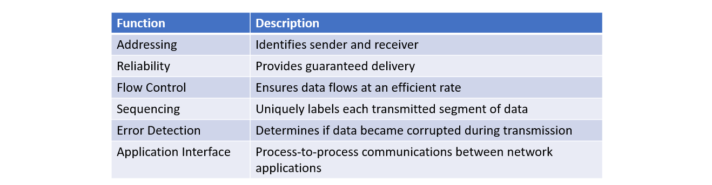

Udemy Course >> Network Administration + Networking Essentials Part 6

Network Administration + IT Computer Network Fundamentals + Theory + Network Engineering + Networking Essentials Part 6

**********

Topics:
- XXX

**********

Tips/Tricks/Notes/Commands URL Link: https://github.com/nimaxnimax/Udemy_Net_Admin_Essentials

Instructor & Courses >> https://www.udemy.com/user/adrian-fischer-infotech/

**********

Network Protocol

Network protocols define a common set of rules.

Can be implemented on devices in:

Software

Hardware

Both

Protocols have their own:

Function

Format

Rules
 

**********

Network Protocol Functions

Devices use agreed-upon protocols to communicate.

Protocols may have may have one or functions.

**********

**********

**********

**********

**********

**********

**********

**********

**********

Tips/Tricks/Notes/Commands URL Link: https://github.com/nimaxnimax/Udemy_Net_Admin_Essentials

Instructor & Courses >> https://www.udemy.com/user/adrian-fischer-infotech/

