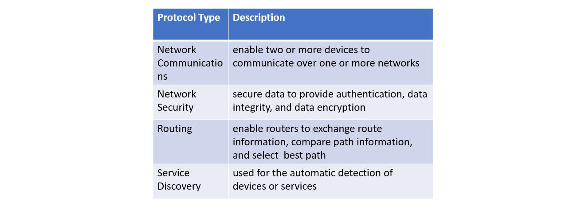

Udemy Course >> Network Administration + Networking Essentials Part 6

Network Administration + IT Computer Network Fundamentals + Theory + Network Engineering + Networking Essentials Part 6

**********

Topics:
- Network Protocol
- Network Protocol Functions
- Protocol Interaction
- Network Protocol Suites
- Evolution of Protocol Suites
- TCP/IP Protocol Example
- TCP/IP Protocol Suite

**********

Tips/Tricks/Notes/Commands URL Link: https://github.com/nimaxnimax/Udemy_Net_Admin_Essentials

Instructor & Courses >> https://www.udemy.com/user/adrian-fischer-infotech/

**********

Network Protocol

Network protocols define a common set of rules.

Can be implemented on devices in:

Software

Hardware

Both

Protocols have their own:

Function

Format

Rules
 
**********

Network Protocol Functions

Devices use agreed-upon protocols to communicate.

Protocols may have may have one or functions.

**********

Protocol Interaction

Networks require the use of several protocols.

Each protocol has its own function and format.

**********

Network Protocol Suites

Protocols must be able to work with other protocols.

Protocol suite:

A group of inter-related protocols necessary to perform a communication function

Sets of rules that work together to help solve a problem

The protocols are viewed in terms of layers:

Higher Layers

Lower Layers- concerned with moving data and provide services to upper layers

**********

Evolution of Protocol Suites

There are several protocol suites.

Internet Protocol Suite or TCP/IP- The most common protocol suite and maintained by the Internet Engineering Task Force (IETF)

Open Systems Interconnection (OSI) protocols- Developed by the International Organization for Standardization (ISO) and the International Telecommunications Union (ITU)

AppleTalk- Proprietary suite release by Apple Inc.

Novell NetWare- Proprietary suite developed by Novell Inc.

**********

TCP/IP Protocol Example

TCP/IP protocols operate at the application, transport, and internet layers.

The most common network access layer LAN protocols are Ethernet and WLAN (wireless LAN).

**********

TCP/IP Protocol Suite

TCP/IP is the protocol suite used by the internet and includes many protocols.

TCP/IP is:

An open standard protocol suite that is freely available to the public and can be used by any vendor

A standards-based protocol suite that is endorsed by the networking industry and approved by a standards organization to ensure interoperability 

**********

**********

**********

**********

Tips/Tricks/Notes/Commands URL Link: https://github.com/nimaxnimax/Udemy_Net_Admin_Essentials

Instructor & Courses >> https://www.udemy.com/user/adrian-fischer-infotech/

