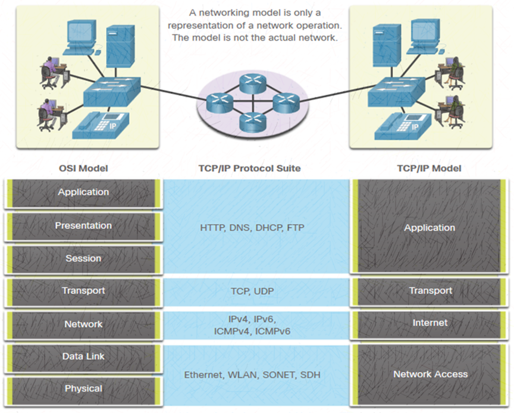
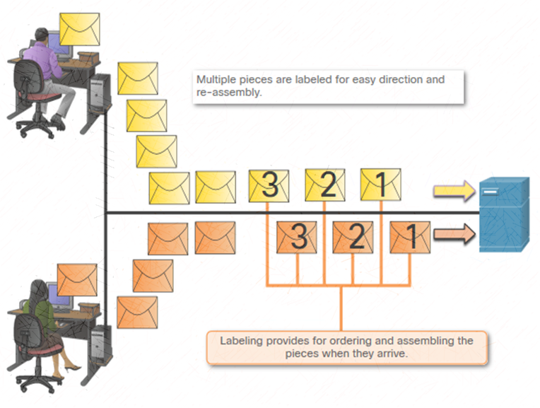
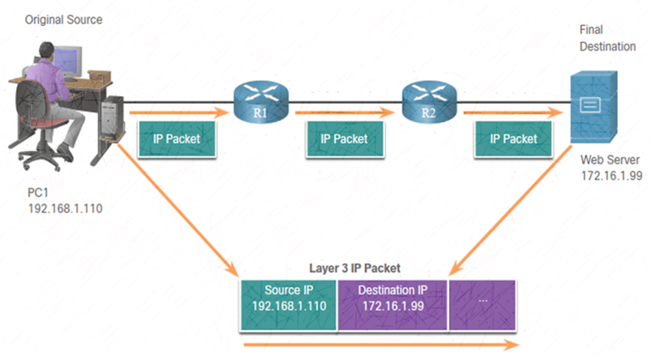
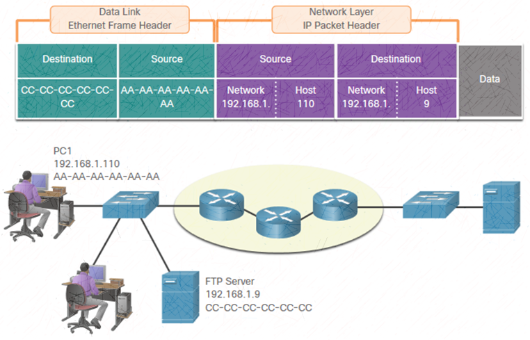
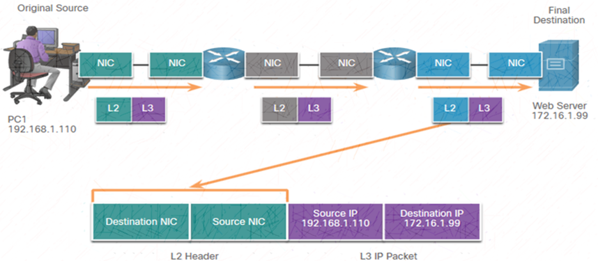

Udemy Course >> Network Administration + Networking Essentials Part 7

Network Administration + IT Computer Network Fundamentals + Theory + Network Engineering + Networking Essentials Part 7

**********

Tips/Tricks/Notes/Commands URL Link: https://github.com/nimaxnimax/Udemy_Net_Admin_Essentials

Instructor & Courses >> https://www.udemy.com/user/adrian-fischer-infotech/

**********

Standards Organizations

Open Standards

Open standards encourage:
interoperability
competition
innovation

Standards organizations are:
vendor-neutral 
non-profit organizations 
established to develop and promote the concept of open standards. 
 
**********

Standards Organizations

Internet Standards

Internet Society (ISOC) - Promotes the open development and evolution of internet

Internet Architecture Board (IAB) - Responsible for management and development of internet standards

Internet Engineering Task Force (IETF) - Develops, updates, and maintains internet and TCP/IP technologies

Internet Research Task Force (IRTF) - Focused on long-term research related to internet and TCP/IP protocols

**********

Standards Organizations

Internet Standards

Standards organizations involved with the development and support of TCP/IP

Internet Corporation for Assigned Names and Numbers (ICANN) -  Coordinates IP address allocation, the management of domain names, and assignment of other information

Internet Assigned Numbers Authority (IANA) - Oversees and manages IP address allocation, domain name management, and protocol identifiers for ICANN

**********

Standards Organizations

Electronic and Communications Standards

Institute of Electrical and Electronics Engineers (IEEE, pronounced “I-triple-E”) - dedicated to creating standards in power and energy, healthcare, telecommunications, and networking

Electronic Industries Alliance (EIA) - develops standards relating to electrical wiring, connectors, and the 19-inch racks used to mount networking equipment

Telecommunications Industry Association (TIA) - develops communication standards in radio equipment, cellular towers, Voice over IP (VoIP) devices, satellite communications, and more

International Telecommunications Union-Telecommunication Standardization Sector (ITU-T) - defines standards for video compression, Internet Protocol Television (IPTV), and broadband communications, such as a digital subscriber line (DSL)

**********

Reference Models

The Benefits of Using a Layered Model

Complex concepts such as how a network operates can be difficult to explain and understand. For this reason, a layered model is used.

Two layered models describe network operations:

Open System Interconnection (OSI) Reference Model

TCP/IP Reference Model

**********

Reference Models

The Benefits of Using a Layered Model

These are the benefits of using a layered model:

Assist in protocol design because protocols that operate at a specific layer have defined information that they act upon and a defined interface to the layers above and below

Foster competition because products from different vendors can work together

Prevent technology or capability changes in one layer from affecting other layers above and below

Provide a common language to describe networking functions and capabilities 

**********

Reference Models

The OSI Reference Model

1 - Physical

Describes the means to activate, maintain, and de-activate physical connections.

2 - Data Link

Describes methods for exchanging data frames over a common media.

3 - Network

Provides services to exchange the individual pieces of data over the network.

4 - Transport

Defines services to segment, transfer, and reassemble the data for individual communications.

5 - Session

Provides services to the presentation layer and to manage data exchange.

6 - Presentation

Provides for common representation of the data transferred between application layer services.

7 - Application

Contains protocols used for process-to-process communications.

**********

Reference Models

The TCP/IP Reference Model

Network Access

Controls the hardware devices and media that make up the network.

Internet

Determines the best path through the network.

Transport

Supports communication between various devices across diverse networks.

Application

Represents data to the user, plus encoding and dialog control.

**********

Reference Models

OSI and TCP/IP Model Comparison

The OSI model divides the network access layer and the application layer of the TCP/IP model into multiple layers.

The TCP/IP protocol suite does not specify which protocols to use when transmitting over a physical medium.

OSI Layers 1 and 2 discuss the necessary procedures to access the media and the physical means to send data over a network.

**********

Data Encapsulation

Segmenting Messages

Segmenting is the process of breaking up messages into smaller units. Multiplexing is the processes of taking multiple streams of segmented data and interleaving them together.

Segmenting messages has two primary benefits:

Increases speed - Large amounts of data can be sent over the network without tying up a communications link.

Increases efficiency - Only segments which fail to reach the destination need to be retransmitted, not the entire data stream.

**********

Data Encapsulation

Sequencing

Sequencing messages is the process of numbering the segments so that the message may be reassembled at the destination.

TCP is responsible for sequencing the individual segments.

**********

Data Encapsulation

Protocol Data Units

Encapsulation is the process where protocols add their information to the data.

At each stage of the process, a PDU has a different name to reflect its new functions. 

There is no universal naming convention for PDUs, in this course, the PDUs are named according to the protocols of the TCP/IP suite. 

PDUs passing down the stack are as follows:

Data (Data Stream)

Segment

Packet

Frame

Bits (Bit Stream)

**********

Data Encapsulation

Encapsulation Example

Encapsulation is a top down process.

The level above does its process and then passes it down to the next level of the model. This process is repeated by each layer until it is sent out as a bit stream.

**********

Data Encapsulation

De-encapsulation Example

Data is de-encapsulated as it moves up the stack.

When a layer completes its process, that layer strips off its header and passes it up to the next level to be processed. This is repeated at each layer until it is a data stream that the application can process.

Received as Bits (Bit Stream)

Frame

Packet

Segment

Data (Data Stream)

**********

Data Access

Addresses

Both the data link and network layers use addressing to deliver data from source to destination.

Network layer source and destination addresses - Responsible for delivering the IP packet from original source to the final destination. 

Data link layer source and destination addresses – Responsible for delivering the data link frame from one network interface card (NIC) to another NIC on the same network.

**********

Data Access

Layer 3 Logical Address

The IP packet contains two IP addresses:

Source IP address - The IP address of the sending device,  original source of the packet.

Destination IP address - The IP address of the receiving device, final destination of the packet.

These addresses may be on the same link or remote.

**********

Data Access

Layer 3 Logical Address 

An IP address contains two parts:

Network portion (IPv4) or Prefix (IPv6)  

The left-most part of the address indicates the network group which the IP address is a member.

Each LAN or WAN will have the same network portion.

Host portion (IPv4) or Interface ID (IPv6) 

The remaining part of the address identifies a specific device within the group. 

This portion is unique for each device on the network.

**********

Data Access

Devices on the Same Network

When devices are on the same network the source and destination will have the same number in network portion of the address.

PC1 – 192.168.1.110

FTP Server – 192.168.1.9

**********

Data Access

Role of the Data Link Layer Addresses: Same IP Network

When devices are on the same Ethernet network the data link frame will use the actual MAC address of the destination NIC.

MAC addresses are physically embedded into the Ethernet NIC and are local addressing.

The Source MAC address will be that of the originator on the link.

The Destination MAC address will always be on the same link as the source, even if the ultimate destination is remote.

**********

Data Access

Devices on a Remote Network

What happens when the actual (ultimate) destination is not on the same LAN and is remote? 

What happens when PC1 tries to reach the Web Server?

Does this impact the network and data link layers?

**********

Data Access

Role of the Network Layer Addresses

When the source and destination have a different network portion, this means they are on different networks.

PC1 – 192.168.1

Web Server – 172.16.1

**********

Data Access

Role of the Data Link Layer Addresses: Different IP Networks

When the final destination is remote, Layer 3 will provide Layer 2 with the local default gateway IP address, also known as the router address.

The default gateway (DGW) is the router interface IP address that is part of this LAN and will be the “door” or “gateway” to all other remote locations.

All devices on the LAN must be told about this address or their traffic will be confined to the LAN only. 

Once Layer 2 on PC1 forwards to the default gateway (Router), the router then can start the routing process of getting the information to actual destination. 

**********

Data Access

Role of the  Data Link Layer Addresses: Different IP Networks

The data link addressing is local addressing so it will have a source and destination for each link.

The MAC addressing for the first segment is :

Source –  AA-AA-AA-AA-AA-AA (PC1) Sends the frame.

Destination – 11-11-11-11-11-11 (R1- Default Gateway MAC) Receives the frame.

Note: While the L2 local addressing will change from link to link or hop to hop, the L3 addressing remains the same.

**********

Data Access

Data Link Addresses

Since data link addressing is local addressing,  it will have a source and destination for each segment or hop of the journey to the destination.

The MAC addressing for the first segment is:

Source –  (PC1 NIC) sends frame

Destination – (First Router- DGW interface) receives frame

**********

Data Access

Data Link Addresses 

The MAC addressing for the second hop is:

Source –  (First Router- exit interface) sends frame

Destination – (Second Router) receives frame

**********

Data Access

Data Link Addresses

The MAC addressing for the last segment is:

Source –  (Second Router- exit interface) sends frame

Destination – (Web Server NIC) receives frame

**********

Data Access

Data Link Addresses

Notice that the packet is not modified, but the frame is changed, therefore the L3 IP addressing does not change from segment to segment like the L2 MAC addressing.

The L3 addressing remains the same since it is global and the ultimate destination is still the Web Server.

**********
