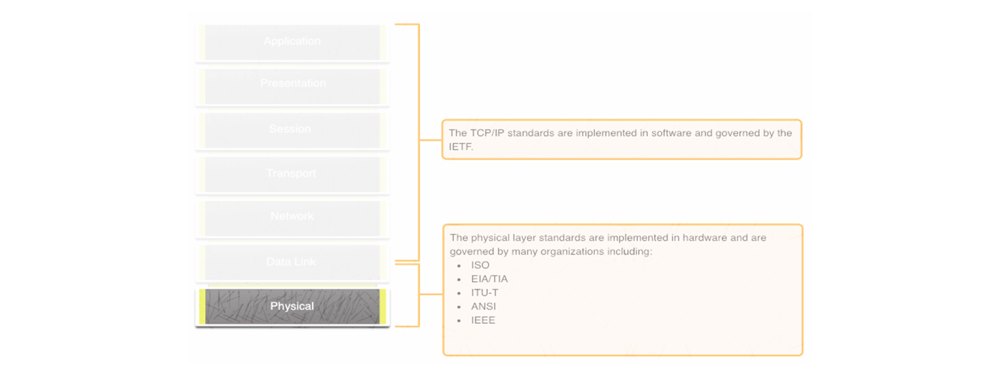
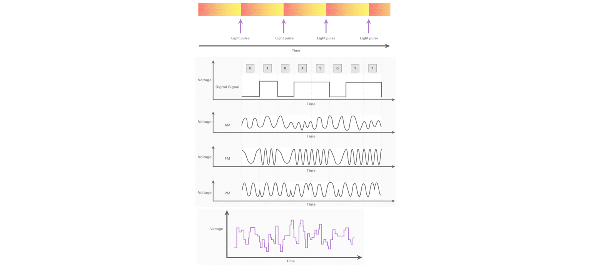

Udemy Course >> Network Administration + Networking Essentials Part 8

Network Administration + IT Computer Network Fundamentals + Theory + Network Engineering + Networking Essentials Part 8

Tips/Tricks/Notes/Commands URL Link: https://github.com/nimaxnimax/Udemy_Net_Admin_Essentials

Instructor & Courses >> https://www.udemy.com/user/adrian-fischer-infotech/

Physical Layer

- Fundamental layer: The Physical Layer is the lowest layer in the OSI model and deals with the physical transmission of data bits over a communication channel.
- Transmission media: It encompasses various physical media such as copper wires, optical fibers, and wireless channels, which are used to transmit data signals.
- Data encoding: It involves converting digital data into a format suitable for transmission over the chosen medium. This includes techniques like modulation and line coding.
- Signal characteristics: The Physical Layer deals with aspects such as signal strength, attenuation, noise, and modulation schemes to ensure reliable data transmission.
- Transmission rates: It defines the maximum data rate at which bits can be transmitted over the medium, which is influenced by factors like bandwidth and signal-to-noise ratio.
- Connection establishment: In some cases, the Physical Layer is responsible for establishing, maintaining, and terminating physical connections between devices, such as in Ethernet networks.
- Standards and protocols: Various standards and protocols, such as Ethernet, Wi-Fi, and Bluetooth, define the Physical Layer specifications to ensure interoperability among devices from different manufacturers.
- Multiplexing: It may involve techniques like time-division multiplexing (TDM) or frequency-division multiplexing (FDM) to allow multiple signals to share the same medium.
- Error detection and correction: The Physical Layer may incorporate mechanisms for detecting and correcting errors that occur during transmission, enhancing data reliability.
- Hardware components: It encompasses the physical hardware components like network interface cards (NICs), transceivers, repeaters, and hubs that facilitate data transmission across the network medium.

Physical Layer >> In designing and implementing networks, several considerations are crucial for the Physical Layer

1. **Medium Selection**: Choosing the appropriate transmission medium based on factors like distance, bandwidth requirements, susceptibility to interference, and cost. For instance, fiber optics might be preferred for long-distance, high-bandwidth transmissions, while twisted pair cables are suitable for shorter distances with moderate bandwidth requirements.

2. **Data Encoding**: Selecting the appropriate encoding scheme to ensure efficient and reliable transmission of data over the chosen medium. This includes considerations such as modulation techniques, line coding, and spectral efficiency.

3. **Transmission Rate**: Determining the required data transmission rate based on the application's needs and the capabilities of the chosen medium. This involves balancing factors like bandwidth availability, latency requirements, and data throughput.

4. **Signal Integrity**: Ensuring that transmitted signals maintain their integrity throughout the transmission process, minimizing factors like attenuation, distortion, and electromagnetic interference. Proper shielding, signal amplification, and error correction techniques may be necessary to maintain signal quality.

5. **Error Detection and Correction**: Implementing mechanisms for detecting and correcting errors that may occur during transmission, such as parity checking, cyclic redundancy check (CRC), or forward error correction (FEC). This helps improve data reliability and integrity.

6. **Compatibility and Interoperability**: Ensuring that the Physical Layer implementation adheres to relevant standards and protocols to guarantee compatibility and interoperability with other network devices and systems. Compliance with standards like IEEE, ITU-T, and ANSI is essential for seamless communication across heterogeneous networks.

7. **Scalability and Future-Proofing**: Designing the Physical Layer infrastructure to accommodate future growth and technological advancements. This involves considering scalability factors such as additional bandwidth requirements, increased data rates, and evolving transmission technologies.

8. **Power Consumption**: Minimizing power consumption of Physical Layer components, especially in mobile or battery-powered devices, to extend battery life and reduce energy costs. This includes optimizing transmission power levels, implementing power-saving modes, and selecting energy-efficient components.

9. **Physical Security**: Implementing measures to protect the Physical Layer infrastructure from unauthorized access, tampering, or physical damage. This may involve deploying security mechanisms such as encryption, access control, and surveillance to safeguard network assets and data.

10. **Redundancy and Fault Tolerance**: Incorporating redundancy and fault-tolerant features into the Physical Layer design to ensure continuous operation and resilience against failures or disruptions. Redundant links, backup power supplies, and automatic failover mechanisms help maintain network availability and reliability.

Purpose of the Physical Layer >> The Physical Connection

- Before any network communications can occur, a physical connection to a local network must be established.
- This connection could be wired or wireless, depending on the setup of the network.
- This generally applies whether you are considering a corporate office or a home.
- A Network Interface Card (NIC) connects a device to the network.
- Some devices may have just one NIC, while others may have multiple NICs (Wired and/or Wireless, for example).
- Not all physical connections offer the same level of performance.

Purpose of the Physical Layer >> The Physical Layer

- Transports bits across the network media
- Accepts a complete frame from the Data Link Layer and encodes it as a series of signals that are transmitted to the local media
- This is the last step in the encapsulation process.
- The next device in the path to the destination receives the bits and re-encapsulates the frame, then decides what to do with it.

Physical Layer Characteristics

- **Transmission Medium**: Utilizes physical transmission media such as copper wires, optical fibers, and wireless channels.
- **Data Encoding**: Converts digital data into a format suitable for transmission over the medium, employing techniques like modulation and line coding.
- **Signal Characteristics**: Deals with aspects such as signal strength, attenuation, noise, and modulation schemes to ensure reliable data transmission.
- **Transmission Rates**: Defines the maximum data rate at which bits can be transmitted over the medium, influenced by factors like bandwidth and signal-to-noise ratio.
- **Connection Establishment**: Responsible for establishing, maintaining, and terminating physical connections between devices in some cases.
- **Standards and Protocols**: Various standards and protocols define Physical Layer specifications to ensure interoperability among devices from different manufacturers.
- **Multiplexing**: Techniques such as time-division multiplexing (TDM) or frequency-division multiplexing (FDM) allow multiple signals to share the same medium.
- **Error Detection and Correction**: Incorporates mechanisms for detecting and correcting errors that occur during transmission, enhancing data reliability.
- **Hardware Components**: Involves physical components like network interface cards (NICs), transceivers, repeaters, and hubs facilitating data transmission across the network medium.

Physical Layer
**Standards:**

- **Ethernet**: A widely used standard for wired LAN connections, defining Physical Layer specifications for various Ethernet standards such as 10BASE-T, 100BASE-TX, and 1000BASE-T.
- **Wi-Fi (IEEE 802.11)**: Specifies Physical Layer characteristics for wireless LANs, including modulation techniques, frequency bands, and data rates.
- **Bluetooth**: Defines Physical Layer specifications for short-range wireless communication, enabling connectivity between devices like smartphones, tablets, and IoT devices.
- **Fiber Optics (IEEE 802.3)**: Specifies Physical Layer standards for optical fiber-based Ethernet networks, including Gigabit Ethernet and 10 Gigabit Ethernet over fiber.
- **ITU-T G.703**: Defines Physical Layer characteristics for digital transmission systems over metallic cables, commonly used in telecommunications networks.
- **ITU-T G.652**: Specifies Physical Layer standards for single-mode optical fibers, outlining characteristics such as attenuation, dispersion, and cutoff wavelength.
- **USB (Universal Serial Bus)**: Specifies Physical Layer characteristics for connecting devices via USB cables, defining parameters such as cable length, signaling voltage, and data rates.

Physical Layer Characteristics >> Physical Components

Physical Layer Standards address three functional areas:
- Physical Components
- Encoding
- Signaling

The Physical Components are the hardware devices, media, and other connectors that transmit the signals that represent the bits.
- Hardware components like NICs, interfaces and connectors, cable materials, and cable designs are all specified in standards associated with the physical layer.

Physical Layer Characteristics >> Encoding

- Encoding converts the stream of bits into a format recognizable by the next device in the network path.
- This ‘coding’ provides predictable patterns that can be recognized by the next device.
- Examples of encoding methods include Manchester (shown in the figure), 4B/5B, and 8B/10B.

Light Pulses Over Fiber-Optic Cable & Microwave Signals Over Wireless & Electrical Signals Over Copper Cable

Physical Layer Characteristics >> Signaling

- The signaling method is how the bit values, “1” and “0” are represented on the physical medium.
- The method of signaling will vary based on the type of medium being used.

